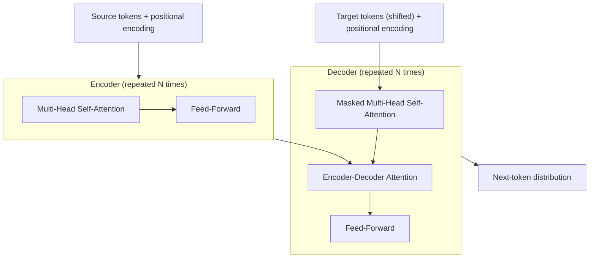

Sequence-to-sequence modeling has had a clear direction over the last few years: stack recurrent layers, add attention to help with long-range dependencies, and push training throughput as far as GPUs will allow. That recipe works, but it comes with a stubborn cost: recurrence is inherently sequential.

This week, a new preprint from Google Research and Google Brain proposes a clean break from that constraint. In *“Attention Is All You Need”*, Vaswani et al. introduce the **Transformer**, a sequence transduction model built **entirely from attention and feed-forward layers**, with no recurrence and no convolution.

The claim is straightforward and ambitious: for machine translation, *self-attention plus the right training recipe* is enough to match or beat strong recurrent baselines while training substantially faster.

## The Problem: Great Accuracy, Slow Training

Recurrent neural networks (and their gated variants) are strong at modeling sequences, but they hide a scaling issue:

- Each token depends on the previous hidden state.
- That dependency serializes training and inference along time.
- Longer sequences limit utilization even on large accelerators.

Attention layers partially relieve the bottleneck by letting the model directly “look” at relevant source positions, but standard encoder-decoder stacks still carry a recurrent core.

## The Transformer: Attention-Only Blocks

The Transformer keeps the familiar encoder/decoder structure, but replaces recurrent layers with repeated blocks built from:

1. **Multi-head self-attention**
2. **Position-wise feed-forward networks**
3. **Residual connections + layer normalization**

Because self-attention operates on the entire sequence at once, the model can process tokens in parallel during training (subject to attention’s quadratic cost in sequence length).

{: .prompt-info }
The most important structural change is that the model’s “sequence mixing” happens through attention, not through a recurrent hidden state update.

## Self-Attention, In One Paragraph

At each layer, the model computes a new representation for every position by forming a weighted sum of all positions. The weights come from a similarity score between:

- a **query** vector for the current position, and
- **key** vectors for candidate positions,

applied to corresponding **value** vectors. In the paper, this is implemented as scaled dot-product attention.

Multi-head attention runs this process several times in parallel (with different learned projections), then concatenates the results. The intuition is that different heads can specialize: local alignment, long-range dependencies, syntactic cues, or other patterns that are hard to capture with a single attention map.

## But Without Recurrence, Where Does Order Come From?

Attention is permutation-invariant: if you shuffle tokens, the attention mechanism itself doesn’t know you did. The Transformer fixes that by adding **positional encodings** to token embeddings at the bottom of the network.

The paper uses sinusoidal positional encodings (though learned alternatives are possible) so that relative positions can be represented through linear operations in embedding space.

{: .prompt-tip }
If you want the shortest conceptual summary: **the Transformer replaces “time” with “position features,” and replaces recurrence with “content-based routing.”**

## Why This Is Fast

Training speed comes from two places:

- **Parallelism**: attention over a full sequence can be implemented as matrix operations (highly optimized on GPUs/TPUs).
- **Shorter paths**: any token can attend directly to any other token in one hop per layer. In deep recurrent stacks, long-range interactions effectively traverse many sequential steps.

The trade-off is attention’s **O(n²)** memory/time scaling with sequence length *n*. For translation-length sentences, that may be a good exchange; for very long contexts, it becomes a constraint worth watching.

## Reported Results (WMT Translation)

Vaswani et al. report strong results on machine translation benchmarks, including:

- **WMT 2014 English→German**: 28.4 BLEU with their “big” model
- **WMT 2014 English→French**: 41.8 BLEU with their “big” model

They also emphasize that the model trains quickly: the reported base model trains in hours on modern hardware rather than days.

## Engineering Implications: A New Default Building Block

Even if you never ship a translation system, the Transformer is notable as an engineering primitive:

- A reusable **encoder** for turning sequences into context-aware embeddings.
- A reusable **decoder** for autoregressive generation.
- A modular block (attention + MLP) that can likely move across domains.

{: .prompt-warning }
The model is conceptually simple, but the training recipe is not: dropout placement, learning-rate schedule, label smoothing, and batching details matter for stability and quality.

## Open Questions (As Of June 2017)

The paper answers “can attention replace recurrence for translation?” with a compelling “yes,” but it also raises a set of questions that feel immediately practical:

1. **Long sequences**: what architecture tweaks (or sparsity tricks) will be needed when *n* is large enough that n² attention becomes prohibitive?
2. **Generalization**: translation is the flagship task, but how broadly does this attention-only backbone carry over to parsing, summarization, and other structured prediction problems?
3. **Inductive bias**: recurrence bakes in a notion of sequential state; convolution bakes in locality. What biases does pure attention learn (or fail to learn) without additional structure?
4. **Interpretability**: attention weights are tempting to read as explanations. When do they really correspond to causal reliance vs. convenient correlations?

## A Practical Mental Model

Recurrent models feel like they *compute* a sequence. The Transformer feels like it *routes information* across a sequence.

If that routing view holds up across tasks, it may become a new standard way to think about deep learning architectures: less “scan left-to-right,” more “build a communication graph, then refine it with depth.”

## References

- Vaswani et al., *Attention Is All You Need* (arXiv:1706.03762), June 12, 2017: [arXiv:1706.03762](https://arxiv.org/abs/1706.03762)
