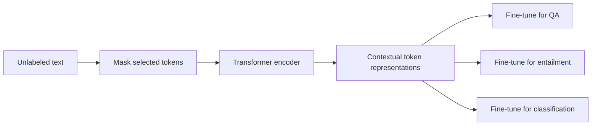

Google's BERT paper is a useful signal. Language-model pretraining is turning into a layer teams can reuse, not a one-off trick.

The headline is simple. Pretrain a deep Transformer encoder on raw text that reads in both directions. Then tune it for each language task with few changes to the model.

The details are where the shift happens. BERT trains by masking: it hides some words and learns to guess them from the words on each side. A model that could see every word while trying to guess it would cheat. Masking blocks that leak.

The result feels less like a one-task pipeline and more like a general engine for text.

{: w="700" h="400" .shadow }
_BERT turns unlabeled text into contextual representations that can be fine-tuned for different NLP tasks._

## What the paper adds

NLP progress was already moving through pretraining. ELMo showed the value of word vectors that change with context. OpenAI's GPT showed that a Transformer language model can be pretrained and then adapted. BERT pushes the encoder side of the Transformer further: it reads both ways at once.

The key move is masking. During training, some input words are hidden. The model learns to guess them from the words around them. So the model can use both sides of a sentence, and the hidden word cannot leak into its own guess.

There is a second task: next sentence prediction. The model learns to tell whether two sentences follow each other in real text. That helps on tasks that compare two sentences, such as entailment and question answering.

The engineering win is reuse. One pretrained encoder can serve many tasks. No one has to design a new model for each one.

## Why both directions matter

A word's meaning often depends on what comes after it. That sounds obvious. Yet many language models read left to right only. For writing text, that makes sense. For reading text, it wastes useful context.

BERT is built for reading tasks. Writing is a side issue here. The model needs to capture the whole sentence around each word.

That split matters for real systems:

- Search can use stronger encodings of queries and pages.
- Question answering can link a question to the right span in a passage.
- Labeling tasks can use meaning in context instead of fixed word vectors.
- Tasks with little data can start from a model trained on huge raw corpora.

This is a good case of the design following the job. If the job is to encode text, an encoder-first model is the natural fit.

## What engineers should notice

BERT is useful because it simplifies the shape of applied NLP work. A team no longer builds a custom model for every task. It starts from a pretrained base and tunes a small task head.

The workflow changes. "Invent a full model" becomes "pick a base, prepare task data, tune with care, and test the failure modes." The hard parts remain, but they move.

The paper also shows how much value sits in the training goal itself. Masking gives a deep two-way encoder a practical way to learn from plain text.

## Limits to keep in view

BERT is an encoder, and the paper's evidence is benchmark scores on language tasks. Open questions remain:

- How costly will pretraining be for teams without big hardware?
- How well will the method work outside English?
- How stable will tuning be on small or noisy datasets?
- How much do benchmark gains reflect real-world strength?
- What happens when the input text is longer than the model can take?

These are engineering questions, not reasons to dismiss the result. They will decide whether the method becomes routine.

{: .prompt-info }
BERT's strongest near-term lesson: the training goal is product design. The model learns the kind of encoding the goal rewards.

## Takeaway

BERT makes language pretraining feel modular. It packs a two-way Transformer encoder into a reusable base for NLP systems.

If the result holds up across more tasks and more teams, applied NLP will look like a tuning workflow on top of large pretrained models. That is a real change in how language software gets built.

## References

- Jacob Devlin, Ming-Wei Chang, Kenton Lee, and Kristina Toutanova, ["BERT: Pre-training of Deep Bidirectional Transformers for Language Understanding"](https://arxiv.org/abs/1810.04805), arXiv:1810.04805, submitted October 11, 2018.
- Ashish Vaswani et al., ["Attention Is All You Need"](https://arxiv.org/abs/1706.03762), arXiv:1706.03762, 2017.
- Matthew E. Peters et al., ["Deep contextualized word representations"](https://arxiv.org/abs/1802.05365), arXiv:1802.05365, 2018.
- Alec Radford et al., ["Improving Language Understanding by Generative Pre-Training"](https://cdn.openai.com/research-covers/language-unsupervised/language_understanding_paper.pdf), OpenAI, 2018.
