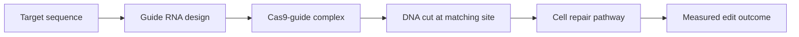

The 2020 Nobel Prize in Chemistry goes to Emmanuelle Charpentier and Jennifer A. Doudna. The prize is for a way to edit the genome. The public phrase is "genetic scissors." The plain version is more direct. CRISPR/Cas9 lets you program biology in a new way.

Programmable does not mean simple. Cells are not text files. Repair paths in the DNA are noisy, delivery is hard, and off-target cuts matter. The biology around the model can swamp it. Still, CRISPR/Cas9 changes the shape of the task. A guide RNA points Cas9 at a chosen spot, so you pick the target apart from most of the cutting parts.

So the work changes shape. Many tests used to need custom-built molecules. Now the loop is plainer: you design a guide, deliver it, measure, and check.

{: w="700" h="400" .shadow }
_You can program where CRISPR/Cas9 cuts. The result in the cell still needs careful checks._

## Why October 7 matters

The prize today marks two steps: the discovery and the tool. Charpentier studied tracrRNA in *Streptococcus pyogenes*. That work helped explain part of the CRISPR immune system in bacteria. Then Charpentier and Doudna rebuilt the system in vitro and made it simpler. They showed it could cut DNA at a chosen site.

The prize rewards one big shift. A bacterial defense became a tool to edit the genome.

{: .prompt-info }
The key idea is that the guide points the way. You change the guide. The rest of the kit can stay much the same.

## A molecular toolchain

People call it scissors. But the work looks more like a toolchain.

Each step has its own limits. Because a guide must be sharp yet active, the design is a hard balance. Delivery then has to reach the right cells, or nothing happens. The cut must land at the right spot. After that, repair should give the edit you want, not a mix of junk. The final check must catch both real edits and side effects.

So CRISPR is both neat and hard. You can read the targeting part. The cell around it stays messy.

## Why it matters for science

In basic research, CRISPR speeds up the work. You can knock out a gene, nudge a path, build a model system, or screen what genes do. To retarget, you just change an RNA sequence, so each of those steps gets faster.

Speed like that matters. Biology is full of linked parts, and one test rarely settles a question. So you run it again, add controls, and try other guides. You also need rescue tests, sequencing, and trait checks. CRISPR makes the change step easy to run at scale.

The Nobel release also points to farm and health uses. These are real lines of work, but the science here is bigger than any one use. CRISPR gives a broad way to ask why, inside a living cell.

## Why it matters for engineers

CRISPR shows that clean design ideas can show up in wet labs too.

The guide RNA works like an address you set. Cas9 runs the cut, and the cell gives the repair. You must test the output in the lab. That does not turn gene editing into software, but the loop will feel known to engineers. You set it, run it, watch it, fix it, and try again.

There is also a platform lesson. A strong base part draws tool builders. Around CRISPR, a whole stack grew up. It holds guide-design tools, pooled screens, delivery vectors, sequencing flows, off-target checks, and lab robots. The cutting enzyme is just one piece.

## Limits and responsibilities

A clean cut at the gene does not mean a clean result in the body. Off-target cuts are real, and so are patchy edits, immune flare-ups, and delivery limits. The ethics are live too. The prize should not flatten all of that into a tidy tale of progress.

Care belongs at the heart of the story. CRISPR/Cas9 is a strong method, and it makes gene editing more open and more orderly. But that openness raises the duty too. You must measure with care, speak plainly, and keep a lab hope apart from a tested use.

The prize marks a tool that changes which tests are now practical. The hard part now is to turn that tool into solid knowledge.

## References

- [Nobel Prize press release: The Nobel Prize in Chemistry 2020](https://www.nobelprize.org/prizes/chemistry/2020/press-release/)
- [Nobel Prize scientific background: A tool for genome editing](https://www.nobelprize.org/prizes/chemistry/2020/advanced-information/)
