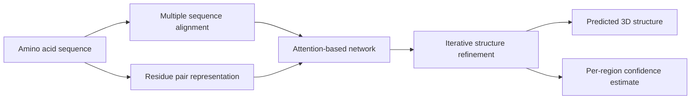

Protein structure prediction has been one of those problems that sits at the boundary between biology, physics, and computation for so long that it becomes easy to treat as permanent background difficulty. Everyone agrees it matters. Fewer people expect a clean step change.

Today may be one of those step changes.

DeepMind and the CASP14 organizers are reporting that AlphaFold has reached a level of accuracy that makes computational structure prediction look much less like an aspirational research target and much more like a practical scientific tool. That does not mean every question in structural biology is solved. It does mean the baseline expectation for what software can do in this space has moved.

{: w="700" h="394" .shadow }
_The important shift is not just better scores. It is the possibility that sequence-to-structure prediction can become part of ordinary biological research workflow._

## Why This Result Matters

Proteins are built from linear amino acid sequences, but they do their work as three-dimensional structures. Enzyme activity, binding behavior, signaling, transport, and a large share of disease biology all depend on shape.

That makes structure prediction unusually valuable. If a computational system can infer usable 3D structure directly from sequence, it can reduce the amount of experimental searching needed before a lab can ask sharper mechanistic questions.

CASP exists precisely to test whether that ambition is real. The competition is blind: participating teams receive sequences for proteins whose structures are not yet public, then submit predictions that are compared against experimental results later. That makes CASP much more meaningful than a benchmark built from already-known structures or self-selected examples.

According to the CASP14 press release and DeepMind's announcement, AlphaFold produced predictions for around two-thirds of targets at accuracy comparable to laboratory methods and reached a median score of 92.4 GDT overall. Even in the hardest free-modelling problems, DeepMind reports a median of 87.0 GDT.

{: .prompt-info }
For this announcement, the most useful mental model is simple: AlphaFold is not claiming to replace all structural biology. It is claiming that for many single-protein targets, prediction quality is now entering experimentally useful territory.

## What DeepMind Says The System Is Doing

DeepMind has not yet published the full paper for this CASP14 system, so the public description is still fairly high level. But the outline is already interesting.

The team describes a folded protein as a kind of spatial graph, where residues act as nodes and important relationships emerge from which residues end up near one another in three-dimensional space. Their latest AlphaFold system uses:

- evolutionarily related sequences gathered through multiple sequence alignment
- a representation of residue-residue pairs
- an attention-based neural network trained end-to-end
- iterative refinement of an internal structural representation
- an internal confidence estimate for predicted regions

That combination matters because it blends several lines of progress that have each been important on their own: better evolutionary signal extraction, better geometric representations, and more capable neural architectures for reasoning over long-range relationships.

This is also a useful reminder that modern AI systems are often strongest when they do not treat scientific domains as generic data problems. AlphaFold appears to be succeeding not by ignoring biology, but by building architecture around biological structure and constraints.

## Why Engineers Should Pay Attention

There is a temptation to file this under "important for biologists" and move on. That would miss the broader lesson.

AlphaFold is a strong example of domain-specific machine learning becoming operationally relevant. The interesting question is no longer whether deep learning can generate impressive scores on scientific tasks. The interesting question is whether it can become part of the working stack for science.

If this result holds up, several things change:

- Structure prediction becomes a front-end tool for hypothesis generation rather than a niche computational specialty.
- Experimental teams can prioritize targets and interpret sequence data faster.
- Drug discovery, protein engineering, and enzyme design workflows gain a better starting point.
- The boundary between simulation, statistical inference, and learned models becomes less rigid.

That last point may be the most durable one. In practical engineering terms, AlphaFold looks like a system that benefits from mixing learned priors with structured scientific representations instead of forcing a choice between them.

## Why The CASP14 Threshold Feels Different

DeepMind already made a strong showing at CASP13 in 2018, and in January this year the company published its earlier AlphaFold methods in *Nature* and released associated CASP13 code. That earlier result was strong enough to get serious attention from computational biologists.

This result feels different because the gap now appears wider and the performance level appears closer to direct scientific use. The CASP14 organizers are not describing a marginal improvement. They are describing a major shift in what prediction systems can reliably do for single protein targets.

Another reason this moment stands out is that the claim is being made in a setting structural biologists already respect. CASP is not a vendor-selected benchmark. It is one of the few places where the field has agreed to a shared scoreboard.

## Where The Limits Still Are

This is the part worth keeping in view, especially for anyone outside the field.

The CASP organizers are explicit that this result applies to single proteins or domains, not protein complexes. DeepMind is also explicit that a full peer-reviewed description of the CASP14 system is still in preparation. That means there are still open questions about reproducibility, method details, compute requirements, and how well the approach transfers to the messier parts of real biological workflow.

There are also practical limitations that no benchmark score alone can answer:

- How robust is performance when sequence homologs are sparse?
- How well do confidence estimates track real failure modes?
- How useful are predictions for dynamic proteins, disordered regions, and conformational switching?
- How directly can predicted structure translate into better wet-lab decisions?
- How accessible will the method be to the broader research community?

{: .prompt-warning }
The strongest version of the claim today is not "protein folding is finished." It is "a major bottleneck for many single-protein structure problems may be weakening much faster than expected."

## The Scientific Workflow Angle

What makes this especially compelling is not just the score, but the workflow implication.

Experimental structure determination remains essential. X-ray crystallography, cryo-EM, and NMR are not going away. But if computational prediction can narrow search space, flag plausible folds, highlight uncertain regions, and accelerate interpretation, then it changes how those experimental methods are used.

That is exactly where AI has the best chance to matter in science: not as a replacement for the lab, but as a multiplier on where the lab spends its time.

For engineers, this is familiar territory. The best tools do not eliminate hard work. They move scarce expert attention to higher-value decisions.

## A Broader Pattern Worth Watching

AlphaFold also reinforces a pattern that keeps showing up across technical fields: the winning systems are often the ones that respect the native structure of the problem.

In language, that meant architectures designed around long-range token relationships. In protein prediction, it now appears to mean architectures that can reason over residue relationships, evolutionary context, and geometry together.

That suggests a useful rule of thumb for applied AI work: the more important the domain constraints are, the less likely it is that a generic model with minimal structure will be enough.

## Takeaway

As of today, the protein folding problem looks less like an untouchable grand challenge and more like a rapidly changing engineering frontier.

That does not mean every protein structure is now trivial to predict. It does mean computational biology has a new reference point. If AlphaFold's CASP14 performance survives deeper scrutiny, then sequence-to-structure prediction is moving from "promising" to "foundational."

For biology, that is a big deal. For machine learning, it is a sign that AI is becoming most interesting when it stops being a demonstration and starts becoming instrumentation.

## References

- DeepMind, ["AlphaFold: a solution to a 50-year-old grand challenge in biology"](https://deepmind.google/blog/alphafold-a-solution-to-a-50-year-old-grand-challenge-in-biology/), November 30, 2020
- CASP14 Organizers, ["Artificial intelligence solution to a 50-year-old science challenge could 'revolutionise' medical research"](https://predictioncenter.org/casp14/doc/CASP14_press_release.pdf), November 30, 2020
- CASP14, ["Home - CASP14"](https://predictioncenter.org/casp14/index.cgi), accessed for experiment scope and results links published November 2020
- DeepMind, ["AlphaFold: Using AI for scientific discovery"](https://deepmind.google/blog/alphafold-using-ai-for-scientific-discovery-2020/), January 15, 2020
- DeepMind Research, [`alphafold_casp13/` on GitHub](https://github.com/deepmind/deepmind-research/tree/master/alphafold_casp13), public code associated with the CASP13 system
