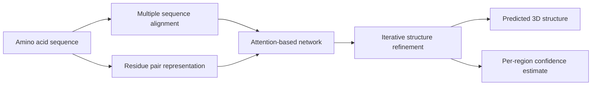

Protein structure prediction sits where biology, physics, and computing meet. It has stayed hard for so long that the field treats it as a fixed fact. Most researchers agree it matters. Fewer expect a clean leap.

Today may be one of those leaps.

DeepMind and the CASP14 organizers say AlphaFold has hit a new level of accuracy. Structure prediction now looks less like a research goal and more like a working tool. Many questions in biology stay open. But the bar for what software can do here has moved.

{: w="700" h="394" .shadow }
_Beyond better scores, sequence-to-structure prediction can become part of ordinary biological research workflow._

## Why this result matters

Proteins start as linear chains of amino acids. But they do their work as 3D shapes. Enzyme activity, binding, signaling, transport, and much of disease biology all turn on shape.

That makes structure prediction rare and useful. A system can read a sequence and infer a usable 3D shape. That cuts the lab work a team faces before it can ask sharper questions about how a protein works.

CASP exists to test whether that goal is real. The contest is blind. Teams get sequences for proteins whose shapes are not yet public. They submit guesses, and those get checked against lab results later. That setup makes CASP far more telling than a test built from known shapes or hand-picked cases.

The CASP14 press release and DeepMind's announcement give the numbers. AlphaFold made predictions for about two-thirds of targets at accuracy on par with lab methods. It hit a median score of 92.4 GDT overall. Even on the hardest free-modelling problems, DeepMind reports a median of 87.0 GDT.

{: .prompt-info }
A simple mental model helps here. AlphaFold does not claim to replace all of structural biology. But for many single-protein targets, its predictions are now good enough to use in experiments.

## What DeepMind says the system is doing

DeepMind has not yet published the full paper for this CASP14 system. The public account is still high level. Even so, the outline is worth a look.

The team treats a folded protein as a kind of spatial graph. Residues act as nodes. The key links come from which residues end up near one another in 3D space. Their latest AlphaFold system uses:

- evolutionarily related sequences gathered through multiple sequence alignment
- a representation of residue-residue pairs
- an attention-based neural network trained end-to-end
- iterative refinement of an internal structural representation
- an internal confidence estimate for predicted regions

That mix matters because it joins several gains that each mattered on their own. Those gains include a better evolutionary signal, better geometry, and stronger neural networks that reason over long-range links.

Modern AI systems tend to work best when they treat a science field on its own terms rather than as a generic data problem. AlphaFold seems to win by shaping its design around biological structure and its limits.

## Why engineers should pay attention

It is tempting to file this under "important for biologists" and move on. That framing misses a wider point for software work.

AlphaFold is a strong case of domain-specific machine learning that pays off in practice. Deep learning has shown it can post high scores on science tasks. The open question is whether it can join the working stack for science.

If this result holds up, several things change:

- Structure prediction turns into a front-end tool for forming ideas, not a niche specialty.
- Lab teams can rank targets and read sequence data faster.
- Drug discovery, protein engineering, and enzyme design gain a better start.
- The line between simulation, statistical inference, and learned models gets softer.

That last point may last the longest. In engineering terms, AlphaFold gains by mixing learned priors with structured science models rather than picking one or the other.

## Why the CASP14 threshold feels different

DeepMind already made a strong showing at CASP13 in 2018. In January this year the company published its earlier AlphaFold methods in *Nature* and released the matching CASP13 code. That earlier result was strong enough to draw serious notice from computational biologists.

This result stands apart for two reasons. The gap now looks wider. And the performance sits closer to direct scientific use. The CASP14 organizers describe a major shift in what these systems can reliably do for single protein targets, well beyond a small gain.

This moment also stands out for where the claim is made. Structural biologists already respect this setting. Unlike a vendor-picked benchmark, CASP is one of the few places where the whole field shares a single scoreboard.

## Where the limits still are

Several limits bound this result. They are easy to miss from outside the field.

The CASP organizers are clear that this result applies to single proteins or domains, not protein complexes. DeepMind is also clear that a full peer-reviewed write-up of the CASP14 system is still in preparation. Open questions remain about reproducibility, method details, and compute cost. It is also unclear how well the approach moves to the messier parts of real biology.

There are practical limits that no benchmark score alone can answer:

- How reliable is performance when sequence homologs are sparse?
- How well do confidence estimates track real failure modes?
- How useful are predictions for dynamic proteins, disordered regions, and conformational switching?
- How directly can predicted structure feed into better wet-lab decisions?
- How widely available will the method be to the research community?

{: .prompt-warning }
The strongest claim today is a narrow one. Protein folding is not solved. But for many single-protein problems, a major bottleneck may be easing far faster than expected.

## The scientific workflow angle

The workflow effect may matter as much as the score.

Lab structure work stays essential. X-ray crystallography, cryo-EM, and NMR are not going away. But prediction can narrow the search, flag likely folds, mark shaky regions, and speed up the read. That changes how the lab methods get used.

This is where AI has the best shot to matter in science. It is a multiplier on where the lab spends its time, not a stand-in for the lab.

For engineers, this is familiar ground. The best tools shift scarce expert focus to higher-value calls. They do not remove the hard work.

## A broader pattern worth watching

AlphaFold also fits a pattern that keeps showing up across technical fields. The systems that win are often the ones that respect how the problem is built.

In language, that meant designs built around long-range token links. In protein prediction, it now seems to mean designs that reason over residue links, evolutionary context, and geometry at once.

A rule of thumb follows for applied AI work. The more the domain limits matter, the less likely a generic model is enough on its own.

## Takeaway

As of today, the protein folding problem reads less like an untouchable grand challenge. It looks more like a fast-moving engineering frontier.

Plenty of protein structures are still hard to predict. But computational biology now has a new reference point. If AlphaFold's CASP14 performance holds up under deeper scrutiny, then sequence-to-structure prediction is moving from "promising" to "foundational."

For biology, that is a big deal. For machine learning, it is a sign of where AI gets interesting. It stops being a demo and starts being a working tool.

## References

- DeepMind, ["AlphaFold: a solution to a 50-year-old grand challenge in biology"](https://deepmind.com/blog/alphafold-a-solution-to-a-50-year-old-grand-challenge-in-biology/), November 30, 2020
- CASP14 Organizers, ["Artificial intelligence solution to a 50-year-old science challenge could 'revolutionise' medical research"](https://predictioncenter.org/casp14/doc/CASP14_press_release.pdf), November 30, 2020
- CASP14, ["Home - CASP14"](https://predictioncenter.org/casp14/index.cgi), accessed for experiment scope and results links published November 2020
- DeepMind, ["AlphaFold: Using AI for scientific discovery"](https://deepmind.com/blog/alphafold-using-ai-for-scientific-discovery-2020/), January 15, 2020
- DeepMind Research, [`alphafold_casp13/` on GitHub](https://github.com/deepmind/deepmind-research/tree/master/alphafold_casp13), public code associated with the CASP13 system
