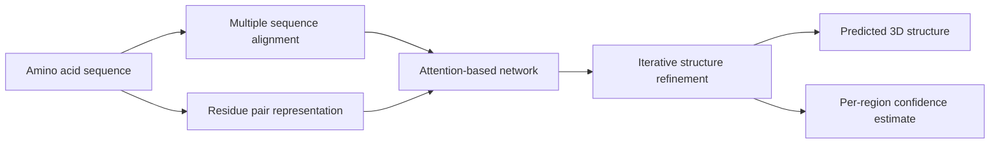

Protein structure prediction sits at the boundary between biology, physics, and computation. It has stayed hard for so long that it is easy to treat as a fixed fact of the field. Most researchers agree it matters. Fewer expect a clean step change.

Today may be one of those step changes.

DeepMind and the CASP14 organizers report that AlphaFold has reached a new level of accuracy. Structure prediction now looks much less like a research target and much more like a working scientific tool. Many questions in biology remain open. But the baseline for what software can do here has moved.

{: w="700" h="394" .shadow }
_Beyond better scores, sequence-to-structure prediction can become part of ordinary biological research workflow._

## Why This Result Matters

Proteins are built from linear amino acid sequences, but they do their work as three-dimensional structures. Enzyme activity, binding, signaling, transport, and much of disease biology all depend on shape.

That makes structure prediction unusually valuable. A system that infers usable 3D structure straight from sequence can cut the lab searching needed before a team asks sharper questions about mechanism.

CASP exists precisely to test whether that ambition is real. The competition is blind. Teams receive sequences for proteins whose structures are not yet public. They submit predictions, and those are checked against experimental results later. That setup makes CASP far more meaningful than a benchmark built from known structures or hand-picked examples.

The CASP14 press release and DeepMind's announcement report the numbers. AlphaFold produced predictions for about two-thirds of targets at accuracy comparable to lab methods. It reached a median score of 92.4 GDT overall. Even in the hardest free-modelling problems, DeepMind reports a median of 87.0 GDT.

{: .prompt-info }
For this announcement, a simple mental model helps. AlphaFold is not claiming to replace all structural biology. For many single-protein targets, prediction quality is now good enough to use in experiments.

## What DeepMind Says The System Is Doing

DeepMind has not yet published the full paper for this CASP14 system. The public description is still fairly high level, but the outline is already interesting.

The team describes a folded protein as a kind of spatial graph. Residues act as nodes. The key relationships come from which residues end up near one another in 3D space. Their latest AlphaFold system uses:

- evolutionarily related sequences gathered through multiple sequence alignment
- a representation of residue-residue pairs
- an attention-based neural network trained end-to-end
- iterative refinement of an internal structural representation
- an internal confidence estimate for predicted regions

That combination matters because it blends several lines of progress that each mattered on their own. Those lines include better evolutionary signal, better geometric representations, and stronger neural networks for reasoning over long-range relationships.

Modern AI systems are often strongest when they treat a scientific field on its own terms rather than as a generic data problem. AlphaFold appears to succeed by building its design around biological structure and constraints.

## Why Engineers Should Pay Attention

It is tempting to file this under "important for biologists" and move on. That framing misses a wider point for software work.

AlphaFold is a strong example of domain-specific machine learning becoming useful in practice. Deep learning has already shown it can post high scores on scientific tasks. The open question is whether it can become part of the working stack for science.

If this result holds up, several things change:

- Structure prediction becomes a front-end tool for forming hypotheses rather than a niche specialty.
- Experimental teams can rank targets and read sequence data faster.
- Drug discovery, protein engineering, and enzyme design gain a better starting point.
- The line between simulation, statistical inference, and learned models gets less rigid.

That last point may be the most durable one. In engineering terms, AlphaFold gains from mixing learned priors with structured scientific models rather than forcing a choice between them.

## Why The CASP14 Threshold Feels Different

DeepMind already made a strong showing at CASP13 in 2018. In January this year the company published its earlier AlphaFold methods in *Nature* and released associated CASP13 code. That earlier result was strong enough to get serious attention from computational biologists.

This result stands apart because the gap now looks wider and the performance sits closer to direct scientific use. The CASP14 organizers describe a major shift in what prediction systems can reliably do for single protein targets, well beyond a small gain.

This moment also stands out because the claim is being made in a setting structural biologists already respect. Rather than a vendor-picked benchmark, CASP is one of the few places where the field shares a single scoreboard.

## Where The Limits Still Are

Several constraints bound this result, and they are easy to overlook from outside the field.

The CASP organizers are clear that this result applies to single proteins or domains, not protein complexes. DeepMind is also clear that a full peer-reviewed write-up of the CASP14 system is still in preparation. Open questions remain about reproducibility, method details, and compute cost. How well the approach moves to the messier parts of real biology is also unclear.

There are also practical limitations that no benchmark score alone can answer:

- How reliable is performance when sequence homologs are sparse?
- How well do confidence estimates track real failure modes?
- How useful are predictions for dynamic proteins, disordered regions, and conformational switching?
- How directly can predicted structure feed into better wet-lab decisions?
- How widely available will the method be to the research community?

{: .prompt-warning }
The strongest claim today is narrow. Protein folding is not finished, but a major bottleneck for many single-protein structure problems may be weakening much faster than expected.

## The Scientific Workflow Angle

The workflow implication may matter as much as the score.

Experimental structure work remains essential. X-ray crystallography, cryo-EM, and NMR are not going away. But prediction can narrow the search space, flag likely folds, mark shaky regions, and speed up the read. That changes how the lab methods get used.

This is where AI has the best chance to matter in science. It acts as a multiplier on where the lab spends its time rather than a stand-in for the lab.

For engineers, this is familiar ground. The best tools shift scarce expert attention to higher-value calls rather than removing hard work.

## A Broader Pattern Worth Watching

AlphaFold also fits a pattern that keeps showing up across technical fields. The systems that win are often the ones that respect the native structure of the problem.

In language, that meant designs built around long-range token relationships. In protein prediction, it now appears to mean designs that reason over residue relationships, evolutionary context, and geometry together.

A rule of thumb follows for applied AI work. The more the domain constraints matter, the less likely a generic model will be enough on its own.

## Takeaway

As of today, the protein folding problem looks less like an untouchable grand challenge and more like a fast-moving engineering frontier.

Plenty of protein structures remain hard to predict, yet computational biology now has a new reference point. If AlphaFold's CASP14 performance survives deeper scrutiny, then sequence-to-structure prediction is moving from "promising" to "foundational."

For biology, that is a big deal. For machine learning, it is a sign of where AI gets interesting. It stops being a demonstration and starts becoming a working tool.

## References

- DeepMind, ["AlphaFold: a solution to a 50-year-old grand challenge in biology"](https://deepmind.google/blog/alphafold-a-solution-to-a-50-year-old-grand-challenge-in-biology/), November 30, 2020
- CASP14 Organizers, ["Artificial intelligence solution to a 50-year-old science challenge could 'revolutionise' medical research"](https://predictioncenter.org/casp14/doc/CASP14_press_release.pdf), November 30, 2020
- CASP14, ["Home - CASP14"](https://predictioncenter.org/casp14/index.cgi), accessed for experiment scope and results links published November 2020
- DeepMind, ["AlphaFold: Using AI for scientific discovery"](https://deepmind.google/blog/alphafold-using-ai-for-scientific-discovery-2020/), January 15, 2020
- DeepMind Research, [`alphafold_casp13/` on GitHub](https://github.com/deepmind/deepmind-research/tree/master/alphafold_casp13), public code associated with the CASP13 system
