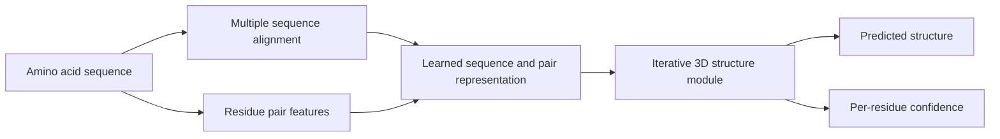

Last November, AlphaFold 2 crossed a threshold. The paper and code release now start to turn that result into a tool the field can run.

DeepMind has published the full *Nature* paper behind its CASP14 result and released the AlphaFold 2 code on GitHub. The open question is no longer "is the benchmark real?" It is "how fast can structure prediction become part of daily lab work?"

The technical feat still stands on its own. But the open method matters just as much. A method gets spelled out, paired with code, and shipped with a usable confidence signal. At that point it stops being a headline. Other researchers can now inspect it, test it, adapt it, and build on it.

{: w="700" h="394" .shadow }
_A strong prediction system now comes with enough method detail to start behaving like a tool._

## What changed this week

The new paper fills in the system behind the CASP14 numbers. AlphaFold 2 is a rebuilt learning system, and it works in one model. It reasons over how sequences relate. It learns how residue pairs sit in space. And it refines a structure over repeated passes.

The numbers are stark. On CASP14 domains, the paper reports a median backbone accuracy of 0.96 angstroms. The next best method scored 2.8 angstroms. Side-chain accuracy is high when the backbone is right. A per-residue confidence score also rates each part of the prediction. It is good enough to matter in real use.

Those details make this release weigh more than a benchmark summary. Researchers now have:

- A peer-reviewed methods paper, not just a conference result.
- Public code, not just slides and headline metrics.
- A clearer confidence model for judging where a prediction is likely to hold.
- Evidence that the method works beyond CASP, on a broader sample of newer PDB structures.

{: .prompt-info }
AlphaFold 2 does not remove the need for lab work. It changes how often a structural insight can arrive before the lab work is done.

## Why the method looks different

AlphaFold 2 reads as a real step change for one main reason. It treats structure prediction as a geometry problem from end to end.

The model blends multiple sequence alignments with a view of residue pairs. Then it updates both views again and again. It does not treat contact prediction and 3D reconstruction as separate stages. It pulls them into one learned loop.

That choice matters because proteins are full of long-range links. Two residues far apart in the sequence can sit side by side in space. Local rules of thumb do not solve that well. AlphaFold 2 looks strong because it learns over the whole structure at once, not one proxy at a time.

## Why confidence scores may matter as much as accuracy

The most useful part of the release may be the confidence signal.

If a model gives only a structure, every user has to guess how much to trust it. AlphaFold 2 adds a per-residue score for local confidence. The score is called pLDDT, short for predicted local-distance difference test. The paper reports that it tracks the true local accuracy.

That makes the output far easier to use with care:

- High-confidence regions can guide a hypothesis, a construct design, or a mutation plan.
- Low-confidence regions can be flagged, not treated as finished structure.
- Pipelines can decide where prediction is safe to use and where an experiment should lead.

This is a familiar software lesson. A model is worth more when it ships its calibration next to its output.

## Why this is bigger than CASP

CASP is still the right proving ground. But the larger point sits elsewhere.

Structural biology has long been capped by throughput. One structure can take months or years to solve in the lab. The paper opens with the scale of the gap. About 100,000 unique protein structures have been solved by experiment, while known protein sequences run into the billions.

That gap has long split what we know about sequence from what we know about shape. If prediction is now good enough across many proteins, several workflows can move faster:

- Functional notes for newly described proteins.
- Ranking of wet-lab experiments by priority.
- Reading disease-linked variants in structured regions.
- Screening candidate enzymes or binding sites before costly follow-up.
- Comparing protein families that have little structural data.

Prediction can now do more of the search up front, before lab teams spend scarce experimental time.

## The engineering angle

AlphaFold 2 is also a good reminder. Real AI progress often comes from respecting the structure of the domain.

The model folds in biology priors, evolution signals, shape limits, and learned guesses. The result fits the shape of the problem.

Encoding the right domain abstractions is the lesson worth carrying into other fields. The strongest systems often build those abstractions in. They do not just hope that scale alone will find them.

For these teams, the question now is less about theory and more about day-to-day use:

- How do these predictions fit into existing analysis workflows?
- Which tasks gain right away from high-confidence single-chain structures?
- Where should automated use stop and lab checks take over?
- How much compute and setup will labs accept to run or adapt the system in house?

The code release is what makes those questions answerable.

## What still limits the result

The edges are clear.

The paper shows top results, but not blanket certainty. The system is strongest where sequence and shape signals are rich. There it can lock onto a stable fold. Confidence varies by region, which is exactly why the confidence output matters.

Several limits are clear even now:

- Many proteins do not act as one rigid object in every context.
- Disorder, shape change, and binding context can muddy the reading.
- Function often depends on complexes, ligands, membranes, or chemical state, not one chain alone.
- Benchmark accuracy does not answer mechanistic or therapeutic questions on its own.

{: .prompt-warning }
The right near-term use is to let prediction decide what to test next and where to spend the scarce lab time, rather than to replace the experiment.

## Why this release feels durable

Many AI announcements sound big because the result is a surprise. Fewer feel durable, because the package around the result has to survive contact with the field.

This one has a better chance.

The method is now public. The benchmark was run in a setting the community already trusts. The confidence scores make the outputs easier to read. The code release shortens the path from admiration to use. The model's limits may still matter in practice. Even so, the bar for what a prediction system should deliver has moved.

The toolchain shift is what gives the release staying power. Protein structure prediction is moving from a grand-challenge story toward a routine tool.

## Takeaway

The AlphaFold 2 paper matters because it turns a striking result into a tool the field can use.

Biologists still need lab work. Engineers still need better tools, compute pipelines, and checks on the output. But a major block between sequence and structure has eased. That changes how teams search, rank, and reason.

The benchmark announced the result. The paper and code release hand it to the field.

## References

- John Jumper et al., ["Highly accurate protein structure prediction with AlphaFold"](https://www.nature.com/articles/s41586-021-03819-2), *Nature*, published July 15, 2021.
- Google DeepMind, [AlphaFold source code repository](https://github.com/deepmind/alphafold), public GitHub repository accessed for code availability on July 15, 2021.
- CASP14, ["Critical Assessment of protein Structure Prediction"](https://predictioncenter.org/casp14/index.cgi), benchmark context for blind structure prediction evaluation.
