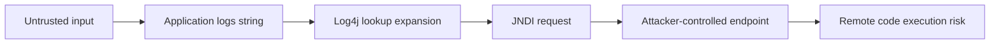

The Log4j bug is filed as CVE-2021-44228. It is the kind of flaw that shows how apps are really built.

On paper, Log4j is a logging library. In practice it sits almost everywhere. It runs in Java services, in business apps, in vendor boxes, in internal tools, and deep in the trees of code we pull in. A remote-code bug in that layer is three problems at once: an inventory problem, an operations problem, and a supply-chain problem.

Apache rates the bug critical, with CVSS 10.0. Bad input in a log message can trigger JNDI lookups. Those lookups can pull in code from a server the attacker runs. This works in vulnerable Log4j Core versions.

{: w="700" h="400" .shadow }
_Log4Shell turns a common logging dependency into an urgent map of where software depends on shared components._

## Why a logging bug can become remote code execution

Logging sounds harmless. A service writes down a string and moves on. The catch is that Log4j can read patterns inside the data it logs. Say an app logs input from an outside user. If the lookup then resolves a remote JNDI endpoint, the log line turns into a way to run code.

Logs take in input from outside users all the time, and that is by design:

- HTTP headers
- user agents
- form inputs
- usernames
- chat messages
- error strings from upstream services

So a weak app may need no special door. Any path that logs outside input can be a target.

## The real work is finding exposure

The first job is to find where Log4j runs.

That sounds easy until you meet a real code graph. A service might pull in Log4j on its own. A framework might drag it in. A vendor product might hide it. A fat JAR might bundle it. Or a stale container image, one no one has rebuilt in months, might still carry it.

So the first checklist is wider than a simple code search:

- Find direct and transitive Log4j Core usage.
- Inspect packaged artifacts, containers, and deployed runtime images.
- Check vendor products and hosted services.
- Prioritize internet-facing systems and systems that process untrusted data.
- Upgrade vulnerable versions to the fixed release path.
- Monitor egress and exploit attempts while patching.

{: .prompt-warning }
Treat this as an exposure-management incident. A library update alone will miss the point. The weak component may sit where its owners never expect it.

## Why this hits the software supply chain

Log4Shell drives home one fact. The code "our code" is only a small slice of what really runs.

A modern app is built from many parts. It uses libraries, frameworks, plugins, container bases, build tools, and managed services. So a security team needs a fast way to ask "where are we running this component?" Suppose the answer needs hand digging during a live attack. Then the team is already behind.

Some habits sound dull on a calm day. They include bills of materials, dependency scans, artifact indexes, and inventory taken at deploy time. On a day like this they read as core tools.

Patch speed works the same way. One team can rebuild, test, and ship fast. Another team needs days of release steps for each service. Those two teams carry very different risk.

## What to do today

Move weak Log4j deployments to fixed versions. Apache lists Log4j Core versions from 2.0-beta9 up to the fixed release ranges as affected. It names 2.15.0 as the Java 8 fixed version for CVE-2021-44228.

Your response should have layers:

- Upgrade Log4j Core where affected.
- Identify applications that package vulnerable JARs.
- Restrict unexpected outbound LDAP/RMI traffic where possible.
- Watch logs and network telemetry for exploit strings and callbacks.
- Ask vendors for explicit statements on affected versions and timelines.
- Keep re-scanning as new deployments roll out.

No single control does the whole job. Patch the library. Cut the chance of a hit. And raise your visibility at the same time.

## Takeaway

Log4Shell is a security event. It is also a lesson in how we design systems.

The bug lives in a logging library. But the real blast radius comes from sprawl and from a thin view of what runs. The teams that do well here can answer three questions fast. Where is the component? Can outside input reach it? And how fast can we swap it out?

Here is the supply-chain lesson in one line. Know what you run, before the next crisis forces you to find out under pressure.

## References

- Apache Logging Services, ["CVE-2021-44228"](https://logging.apache.org/security.html), security advisory for Log4j.
- CVE Program, ["CVE-2021-44228"](https://www.cve.org/CVERecord?id=CVE-2021-44228), vulnerability record.
- CISA, ["Apache Log4j Vulnerability Guidance"](https://www.cisa.gov/news-events/alerts/2021/12/10/apache-log4j-vulnerability-guidance), December 10, 2021.
