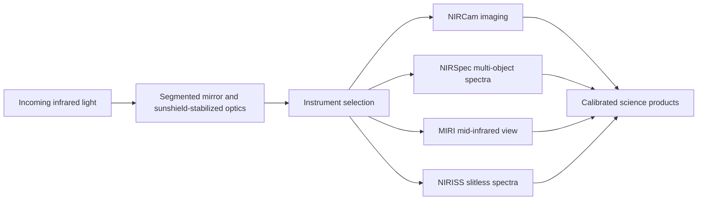

The James Webb Space Telescope is no longer mostly a deployment story. This week it became a science tool in public view.

NASA and its partners have released Webb's first full-color images and spectra. The list covers five targets: SMACS 0723, WASP-96 b, the Southern Ring Nebula, Stephan's Quintet, and the Carina Nebula's NGC 3324 region. The images look great. But the engineering signal runs deeper than the gallery. Webb is showing off a full stack. That stack is optics, cold thermal control, pointing, detectors, filters, spectroscopy, calibration, and image work.

A telescope earns its keep when light can move through the whole system. It has to come out as data that researchers can trust.

{: w="700" h="400" .shadow }
_Webb's first images are more than pictures. They are a full-system checkout of infrared observation, spectroscopy, and data processing._

## Why July 12 matters

The first deep field came out yesterday. But today's release is the fuller technical moment. NASA has now shown the first image set and the spectra together. Webb is a measurement tool too.

The target set is broad on purpose:

- SMACS 0723 tests deep near-infrared imaging and gravitational lensing science.
- WASP-96 b demonstrates exoplanet transmission spectroscopy.
- The Southern Ring Nebula shows dusty stellar death in near- and mid-infrared light.
- Stephan's Quintet shows galaxy interaction, star formation, and black-hole activity.
- The Carina Nebula shows young star formation behind dust.

This is a strong first package. It spans the whole job. Webb is built to study the early universe, how galaxies grow, how stars and planets form, and planetary systems. The first data set touches each lane.

{: .prompt-info }
Read this release as an engineering handoff. Commissioning proves the observatory can run. The first image package proves the data can start doing real science.

## The infrared advantage

Webb's value starts with wavelength.

Visible-light astronomy hits limits in three cases. Light can be stretched by cosmic expansion. Dust can block a view. Or the signal you want is heat or molecules. Webb is built for infrared. So it can see old redshifted light, peer through dust, and read spectral lines from planets and gas.

That range is why one release can cover such different science. Deep-field galaxies, star-forming dust, planet air, and nebula gas all read more clearly at the right wavelengths.

The images are tuned for human eyes. But the data under them is physical. Filters pick out wavelength bands. Spectra split light into lines. Those lines can reveal what a thing is made of, how hot it is, how it moves, and how it is built.

## Spectroscopy is the quiet milestone

The famous parts of the release are the images. But the spectra may matter more for the day-to-day work.

Take WASP-96 b. Webb's NIRISS instrument caught a transmission spectrum. The starlight passed through an exoplanet atmosphere first. NASA reports the signature of water. It also reports evidence for clouds and haze. So the system pulls chemistry from tiny shifts in brightness across wavelengths.

SMACS 0723 shows spectral throughput too. Webb's NIRSpec microshutter array can measure many targets at once. NASA notes that NIRSpec observed 48 galaxies simultaneously in this field.

Here Webb stops feeling like one telescope. It feels more like a platform. One shared optical and thermal system feeds each instrument. Each one is tuned for a different question.

## Systems engineering in public

Webb's first images are also a rare public win for systems engineering.

The observatory carries a heavy task list. It runs near the Sun-Earth L2 point, and the instruments stay cold. The pointing holds steady, and an 18-segment primary mirror stays aligned. The detectors read very faint infrared signals. Each part only pays off when the others behave.

The links between them are easy to miss. Mirror alignment needs stable heat. Faint-signal detectors need precise pointing. A spectrograph needs calibration before it can give you chemistry.

Here is the engineering lesson. Big science tools are pipelines. The final image is what you see. But the real feat is the steady path from photon to a clean, calibrated product.

## What the first targets show

SMACS 0723 is the release's deep-field anchor. NASA calls Webb's image the deepest and sharpest infrared image of the distant universe so far. The galaxy cluster acts as a gravitational lens. It magnifies more distant galaxies behind it. The NIRCam composite totals 12.5 hours of exposure time. It reaches infrared depths past Hubble's deepest fields, which took weeks.

Carina's NGC 3324 region shows the opposite scale of problem. Here the target is nearby star birth hidden by dust, rather than the far universe. Infrared light reveals young stars and structure that dust hides at visible wavelengths.

The Southern Ring Nebula gives a stellar evolution case. Webb's near- and mid-infrared instruments split out structure in the gas and dust around a dying star.

Stephan's Quintet is a galaxy-interaction lab. NASA calls the Webb mosaic its largest image to date at release. It is built from nearly 1,000 image files.

WASP-96 b is the reminder that Webb's science goes beyond flashy images. A spectrum can beat a picture when the question is what an atmosphere is made of.

## What engineers should notice

There is a useful pattern here. It fits any field that mixes hardware, software, and science.

No single magic part carries the first release. It runs on coordination:

- optics collecting faint signal
- thermal systems suppressing noise
- instruments splitting and filtering light
- calibration turning detector output into reliable measurements
- processing pipelines making data interpretable
- public data products letting researchers begin independent work

A science tool earns more value when its output can move past the team that built it.

## Limits and open questions

Early release shots are demos. They are a start, not a finished science catalog. They show what Webb can do. They also create fresh research targets. But they leave the hard questions open. Those are the questions Webb was built to chase.

A few limits stay clear:

- Processed color images are interpretive products. They are read-outs, not a direct human-eye view.
- Spectral claims need careful calibration and follow-up analysis.
- Deep-field candidates still need measurement, sorting, and peer-reviewed reading.
- Long-term output rests on scheduling, operations, stable instruments, and data pipelines as much as first-light buzz.

{: .prompt-warning }
The first images show that Webb is ready for science. They do not replace the slower work of turning observations into durable astrophysical claims.

## Takeaway

Webb's first images are easy to admire as pictures. They get more interesting as proof. They show the observatory working as one joined-up science system.

The release spans the mission's core range. That range covers deep fields, dust-hidden star birth, galaxy crashes, stellar death, and exoplanet air. Infrared astronomy needs engineering at this scale. A faint, cold, stretched, filtered signal is easy to lose, so the hardware has to protect it end to end.

Today, that signal is arriving.

## References

- NASA, ["Webb's First Images"](https://science.nasa.gov/mission/webb/webbs-first-images/), released July 2022.
- NASA Webb Mission Team, ["NASA's Webb Delivers Deepest Infrared Image of Universe Yet"](https://science.nasa.gov/missions/webb/nasas-webb-delivers-deepest-infrared-image-of-universe-yet/), July 12, 2022.
- STScI Webb Telescope, ["First Images from the James Webb Space Telescope"](https://webbtelescope.org/news/first-images), July 2022.
