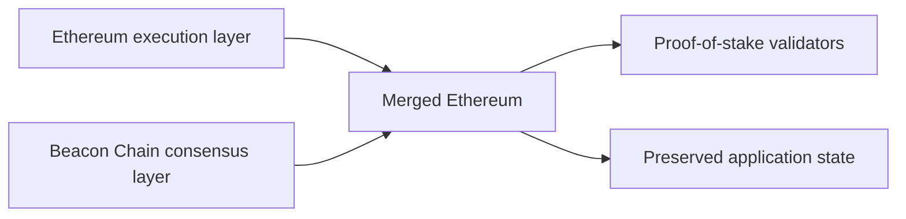

Ethereum just pulled off one of the odder migrations in software. It swapped the consensus engine of a live public network. It did so while keeping the app layer users depend on.

The Merge joins Ethereum Mainnet with the Beacon Chain. Block production moves from proof-of-work mining to proof-of-stake. For users, the chain history stays the same. For node operators, the setup shifts a lot. An execution client now works with a consensus client. And the chain's security model moves from energy-backed mining to staked ETH.

So The Merge is less like a feature release. It is more like changing the engine on a running system.

{: w="700" h="400" .shadow }
_The Merge joins Ethereum's execution layer with the Beacon Chain consensus layer. It keeps chain history. It swaps out how blocks get made._

## What changed

Before The Merge, Ethereum Mainnet ran on proof-of-work. Miners raced to produce blocks. The Beacon Chain launched on its own in 2020. It already ran proof-of-stake in parallel. But it did not handle Mainnet transactions.

The Merge makes the Beacon Chain the consensus layer for Ethereum Mainnet. The execution layer keeps your accounts, contracts, balances, and past trades. The consensus layer picks which blocks are the real ones.

The split matters for operators. A full node now needs two clients: an execution client plus a consensus client. The Engine API connects them.

## Why this is hard

Distributed systems are hard to migrate. The live system is the deploy target. There is no quiet window to take it down. Ethereum is a global open network. Exchanges, wallets, apps, validators, infra providers, and users all watch the same state.

A few things make this migration odd:

- Chain history has to stay intact.
- Apps should not have to redeploy.
- Users should not have to move funds.
- Node operators have to run matching execution and consensus clients.
- The new consensus layer has to steer validators under real economic load.
- The switch has to fire at a set protocol point. Social custom alone cannot trigger it.

In normal software, teams cut risk by sending a small slice of traffic through a new system. Ethereum lacks that option in the same form. The network needs one canonical chain.

## What it does not do

The Merge is big enough that the myths are easy to guess.

The Merge does not directly cut gas fees. Fees track demand and blockspace. This upgrade leaves execution capacity flat. A scaling upgrade would expand it; this one does not.

A few more myths fall here. Old ETH and new ETH stay the same asset. Chain history stays intact. And node operators do not all turn into validators.

The clearest change is consensus, and it is a big one. It pulls proof-of-work mining out of Ethereum. In its place, proof-of-stake picks validators to produce blocks.

{: .prompt-info }
Here is the cleanest frame for The Merge. It is narrow but real. Ethereum changed how it agrees on blocks. The execution layer kept running.

## Energy and security

Energy use makes the easiest headline. Ethereum.org says The Merge cuts Ethereum's energy use by about 99.95%. That comes from dropping proof-of-work mining. With mining, security leans on steady compute and power.

The security model also shifts. Validators stake ETH. They lose ETH if they cheat. So the network drops the old hardware-and-power cost. It now leans on staked funds at risk.

This trade deserves a close watch. Proof-of-stake reshapes operator pay, client mix, validator infra, and how we model attacks. It also clears a large green knock on proof-of-work mining.

## Why engineers should care

Even outside blockchain, The Merge is a useful case study in live migration.

It pulls together:

- staged parallel system work
- long-running testnets and rehearsals
- clients that talk to each other
- protocol-level activation rules
- social coordination across independent operators
- app continuity across a deep infra change

The details are Ethereum-specific. But the pattern is broader. Large systems grow by splitting layers. You prove a new layer in parallel. Then you switch the line where the work lives.

## Takeaway

The Merge is not the end of Ethereum's roadmap. And it does not fix every scaling problem. Its weight is more precise. A public network moved from proof-of-work to proof-of-stake without tossing its execution history.

For a distributed system, that is a big deal. The next questions are about running it.

How varied are the clients? How do validators act? Can the chain resist censorship? What do apps now assume? And how does future scaling work build on the new consensus layer?

For today, the clear fact is that the migration landed.

## References

- Ethereum.org, ["The Merge"](https://ethereum.org/roadmap/merge/), shipped September 15, 2022.
- Ethereum Foundation, ["Mainnet Merge Announcement"](https://blog.ethereum.org/2022/08/24/mainnet-merge-announcement), August 24, 2022.
- Ethereum Foundation, ["How The Merge Impacts Ethereum's Application Layer"](https://blog.ethereum.org/2021/11/29/how-the-merge-impacts-app-layer), November 29, 2021.
