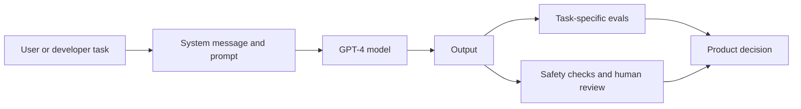

OpenAI shipped GPT-4 today. The release came with a technical report, a system card, an API waitlist, ChatGPT Plus access, and open-source evals. The model grabs the headlines. The quieter change is that evals now ship as part of the product.

GPT-4 is a large multimodal model. It takes image and text inputs and returns text. Image input starts in limited preview. The release also pushes benchmark scores, longer context, system messages, safety work, and the limits that remain.

That mix frames big language models as live systems. How they act depends on prompts, policies, evals, monitoring, user screens, and the rules each developer sets.

{: w="700" h="400" .shadow }
_GPT-4 ties model power, evals, and release policy into one surface._

## Why March 14 matters

The date matters because the release ships many pieces at once. OpenAI is putting out the GPT-4 technical report. It offers text input through ChatGPT and the API. It spells out the limits. And it open-sources OpenAI Evals.

The Evals release matters most for developers. A model that shifts over time needs a way to catch regressions and failures. Benchmarks alone fall short. Each team needs its own checks that map to its own product risk.

{: .prompt-warning }
GPT-4 beats GPT-3.5 on many reported benchmarks. But OpenAI says plainly that it can still hallucinate, reason wrong, and put out risky text.

## The stack around the model

The release makes one thing clear. The model is just one part of a larger system.

System messages give developers a set place to state behavior. Evals give them a way to test it. Safety steps and usage rules set the limits. So the question shifts. It is less "what can the model do?" and more "what can this system do reliably under the constraints of a real workflow?"

## Why evals matter

OpenAI calls Evals a way to build and run benchmarks. It lets you check the model one sample at a time. That helps, because broad academic scores miss many real failures.

For a live feature, the questions are concrete:

- Does the model answer in the required format?
- Does it preserve facts from supplied context?
- Does it refuse unsafe requests in the product's domain?
- Does it introduce security bugs in generated code?
- Does it fail silently when the prompt gets long or ambiguous?

Each one is a software quality question. They need test cases, review loops, and monitoring.

## A new developer contract

The GPT-4 API also shifts how you design an app. The model can be more reliable and more flexible than older ones. But it still needs guardrails. Treat prompts, retrieval, evals, and human review as core parts of the build.

Read the notes on hallucination and high-stakes use as rules for shipping. If an app needs to be correct, ground the model in outside data. Check it against fixed systems where you can. And test it against the failure cases in its own domain.

## Open questions

Some key details stay out of the public report. We do not get the model size or the full training data. That limits outside study. It also means developers will learn many traits by hand, through API use, evals, and live monitoring.

The takeaway is not that GPT-4 ends prompt work or checking. It raises the ceiling, which makes checking worth more. When a model can do harder work, untested guesses cost more too.

GPT-4 makes model power feel like infrastructure. The skill you build around that base is now the edge.

## References

- [OpenAI: GPT-4](https://openai.com/index/gpt-4-research/)
- [GPT-4 technical report](https://arxiv.org/abs/2303.08774)
- [OpenAI Evals repository](https://github.com/openai/evals)
