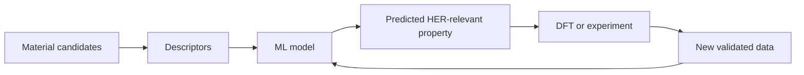

Hydrogen has an appealing promise: it can store energy, support industrial processes, and produce water rather than carbon dioxide at the point of use. But the word "hydrogen" hides the real engineering question.

How do we make clean hydrogen efficiently enough, cheaply enough, and reliably enough to matter?

One important route is water electrolysis, where electricity splits water into hydrogen and oxygen. The hydrogen evolution reaction, or HER, is the half-reaction that produces hydrogen gas. HER is simple to write down, but difficult to optimize in the real world because performance depends heavily on the catalyst surface.

{: w="700" h="394" .shadow }
_Catalyst discovery is a search problem. Chemistry defines the design space, and computation helps decide where to look first._

{: .prompt-info }
This post has been refreshed for clarity and stronger sourcing. The core idea remains the same: AI is most useful in catalyst discovery when it helps chemists ask better next questions.

## The Catalyst Bottleneck

A practical HER catalyst needs to balance several properties at once. It should adsorb hydrogen neither too strongly nor too weakly. It should remain stable under operating conditions. It should conduct charge well, expose enough active sites, and be realistic to synthesize.

Platinum is highly effective, but cost and scarcity make researchers interested in alternatives. That is where two-dimensional materials, doped surfaces, heterostructures, and computational screening become attractive.

The challenge is scale. Once you start varying metals, surface terminations, dopants, defects, layer structures, and synthesis routes, the number of candidates grows faster than experiments or density functional theory calculations can comfortably handle.

## Why MXenes Are Interesting

MXenes are a family of two-dimensional transition-metal carbides, nitrides, and carbonitrides. They are interesting for HER because they can combine:

- High electrical conductivity.
- Tunable surface chemistry.
- Large accessible surface area.
- Layered structures that can expose or modify active sites.
- Compatibility with hybrid catalyst designs.

Review literature has highlighted MXenes as promising HER electrocatalysts because their surfaces can be modified through termination engineering, metal-atom doping, heterostructure formation, and nanostructure design. Those knobs make them exciting, but they also make the search space complicated.

## Where Machine Learning Helps

Machine learning does not replace electrochemistry. It helps prioritize the search.

A typical workflow looks like this:

The model might predict a property such as hydrogen adsorption free energy, often used as a screening proxy for HER activity. It might also help identify which descriptors matter: elemental properties, surface termination, local coordination, orbital features, or structural motifs.

The best work in this area does not treat machine learning as a black box. It tries to connect model features back to chemistry. For example, recent descriptor-focused MXene studies emphasize that model accuracy depends on mechanism-aware features, not just throwing more candidate materials into an algorithm.

## What Makes A Good Descriptor

A descriptor is a compact way of representing a material to a model. In catalyst discovery, a useful descriptor should be simple enough to compute across many candidates but meaningful enough to capture the chemistry that controls performance.

For HER, descriptors often try to capture how hydrogen binds to the surface. If hydrogen binds too weakly, the surface does not activate it. If hydrogen binds too strongly, the surface does not release it efficiently. The ideal catalyst sits near the middle.

That is why descriptors linked to adsorption energy, surface electronic structure, orbital interactions, or local chemical environment can be valuable. They turn an enormous materials space into a more navigable map.

## The Engineering Caveat

There is a danger in making the workflow sound too clean. A good predicted adsorption energy is not the same as a deployable catalyst.

Real HER performance also depends on overpotential, Tafel slope, exchange current density, electrolyte, pH, mass transport, surface reconstruction, durability, synthesis reproducibility, and device integration. A model trained on narrow data can also become overconfident on material families it has not really learned.

{: .prompt-warning }
Machine learning can rank candidates, but it cannot certify a catalyst. The final test is still chemical, electrochemical, and practical.

## Why This Matters

The deeper point is that catalyst discovery is becoming more like an engineering feedback loop. Instead of treating experiments, simulations, and models as separate activities, the strongest workflows connect them.

Machine learning helps when it reduces wasted effort:

- Fewer low-value DFT calculations.
- Better selection of experimental candidates.
- Faster discovery of structure-activity relationships.
- Clearer hypotheses about why a material works.

For hydrogen, that can matter because clean energy systems need materials that are not only high-performing but also scalable and robust.

## Takeaway

AI-assisted HER catalyst discovery is not about letting a model "invent" chemistry on its own. It is about using data-driven tools to make the next experiment or simulation smarter.

MXenes are a strong example because they offer a tunable materials platform with many design choices. Machine learning is valuable because it can help turn those choices from a combinatorial problem into a guided search.

The future of clean hydrogen will depend on more than one catalyst. It will depend on better discovery workflows, and that is where AI can genuinely help.

## References

- Bai et al., ["Recent advances of MXenes as electrocatalysts for hydrogen evolution reaction"](https://www.nature.com/articles/s41699-021-00259-4), _npj 2D Materials and Applications_, 2021.
- Zheng et al., ["High-Throughput Screening of Hydrogen Evolution Reaction Catalysts in MXene Materials"](https://pubs.acs.org/doi/10.1021/acs.jpcc.0c02265), _The Journal of Physical Chemistry C_, 2020.
- Li et al., ["Machine Learning-Assisted Low-Dimensional Electrocatalysts Design for Hydrogen Evolution Reaction"](https://link.springer.com/article/10.1007/s40820-023-01192-5), _Nano-Micro Letters_, 2023.
- Du et al., ["A mechanism-guided descriptor for the hydrogen evolution reaction in 2D ordered double transition-metal carbide MXenes"](https://pubs.rsc.org/en/content/articlehtml/2025/sc/d4sc08725a), _Chemical Science_, 2025.

