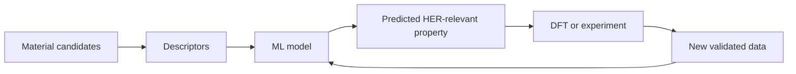

Hydrogen has a nice promise. It can store energy. It can power factories. And it makes water, not carbon dioxide, where you use it. But the word "hydrogen" hides the real problem.

How do we make clean hydrogen cheap enough, fast enough, and steady enough to matter?

One key route is water electrolysis. Here, electricity splits water into hydrogen and oxygen. The hydrogen evolution reaction, or HER, is the half-reaction that makes hydrogen gas. HER is easy to write down. It is hard to tune in the real world, because how well it works rests heavily on the catalyst surface.

{: w="700" h="394" .shadow }
_Finding a catalyst is a search problem. Chemistry sets the space to search. Computing helps decide where to look first._

{: .prompt-info }
This post has been refreshed for clarity and better sources. The core idea has not changed. AI helps most in catalyst work when it helps chemists ask better next questions.

## The catalyst bottleneck

A good HER catalyst has to balance many traits at once. It should grab hydrogen neither too hard nor too weakly. It also has to stay stable while it runs. It must carry charge well. It must expose enough active sites. And it must be real to make.

Platinum works very well. But it costs a lot and is scarce, so teams want other options. That is where new ideas help. Think 2D materials, doped surfaces, heterostructures, and screening by computer.

The catch is scale. You can vary the metals. You can vary the surface caps, the dopants, the defects, the layers, and the way you make it. Soon the list of candidates grows faster than lab tests or density functional theory can keep up with.

## Why MXenes are interesting

MXenes are a family of two-dimensional transition-metal carbides, nitrides, and carbonitrides. They are a good fit for HER. They can mix a few useful traits:

- They carry charge well.
- You can tune their surface chemistry.
- They offer a lot of open surface area.
- Their layers can expose or change active sites.
- They work well in hybrid catalyst designs.

Review papers point to MXenes as strong HER electrocatalysts. You can tweak their surface in many ways: cap the edges, dope in metal atoms, build heterostructures, and shape the nanostructure. Those knobs make them fun to study. They also make the search space large.

## Where machine learning helps

Machine learning will not replace electrochemistry. It helps rank the search.

A typical workflow looks like this:

The model might guess a value like hydrogen adsorption free energy. That value is often used as a screening proxy for HER activity. The model can also show which descriptors matter. These might be the element, the surface cap, the local bonds, the orbitals, or the shape.

The best work here does not treat the model as a black box. It ties model features back to chemistry. As a rule, the model is only as good as its descriptors. They must reflect how the surface binds hydrogen. Tossing more candidate materials at an algorithm rarely helps on its own.

## What makes a good descriptor

A descriptor is a short way to show a material to a model. A good one should be easy to compute across many candidates. It should also be rich enough to catch the chemistry that drives how well the catalyst works.

For HER, descriptors often try to catch how hydrogen binds to the surface. If hydrogen binds too weakly, the surface cannot activate it. If hydrogen binds too strongly, the surface cannot let it go. The best catalyst sits near the middle.

So good descriptors tend to track a few things. They track adsorption energy, surface electrons, orbital effects, or the local chemistry. They turn a huge materials space into a map you can read.

## The engineering caveat

It is easy to make this workflow sound too clean. A good predicted adsorption energy is not the same as a catalyst you can ship.

Real HER performance leans on many other things too. It depends on overpotential, Tafel slope, and exchange current density. It also depends on the electrolyte and the pH. Then there is mass transport, surface reconstruction, and how long the catalyst lasts. You also have to make it the same way each time and fit it into a device. And a model trained on thin data can grow too sure of itself on material families it has not really learned.

{: .prompt-warning }
Machine learning can rank candidates. It cannot certify a catalyst. You still need chemical, electrochemical, and real-world tests to confirm one.

## Why this matters

Catalyst work is turning into an engineering feedback loop. The best workflows tie experiments, models, and simulations together. Weaker ones keep them apart.

Machine learning helps most when it cuts wasted effort:

- Fewer low-value DFT runs.
- Better picks for lab tests.
- Faster reads on which structures drive activity.
- Clearer guesses about why a material works.

For hydrogen, that pays off. Clean energy needs materials that work well, scale up, and last.

## Takeaway

AI-assisted HER catalyst work uses data tools to make the next test or simulation smarter. It does not let a model "invent" chemistry on its own.

MXenes are a strong example. They give you a platform you can tune in many ways. Machine learning is worth it here. It can turn a huge set of choices into a guided search.

Clean hydrogen will rest on more than one catalyst. It will rest on better discovery workflows. And AI can speed those up in a real way.

## References

- Bai et al., ["Recent advances of MXenes as electrocatalysts for hydrogen evolution reaction"](https://www.nature.com/articles/s41699-021-00259-4), _npj 2D Materials and Applications_, 2021.
- Zheng et al., ["High-Throughput Screening of Hydrogen Evolution Reaction Catalysts in MXene Materials"](https://pubs.acs.org/doi/10.1021/acs.jpcc.0c02265), _The Journal of Physical Chemistry C_, 2020.
- Li et al., ["Machine Learning-Assisted Low-Dimensional Electrocatalysts Design for Hydrogen Evolution Reaction"](https://link.springer.com/article/10.1007/s40820-023-01192-5), _Nano-Micro Letters_, 2023.

