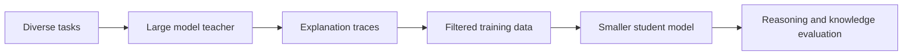

Orca caught my eye because it tested a tempting shortcut in AI. The hope was simple. If a small model copies a big model's answers, maybe it picks up the big model's skill too.

The Orca paper said that is not enough. A small model can copy the style without the reasoning that made the answer good. That gap matters. Copied style can look strong at first. Then it fails on a harder test.

Microsoft Research trained a 13-billion-parameter model. They fed it richer signals from large foundation models. Those signals held explanation traces, step-by-step reasoning, and a mix of task formats. The aim was to see if better teaching could make a small model do more.

{: w="700" h="394" .shadow }
_A student model learns more from a teacher when the data captures the process, not just final answers._

{: .prompt-info }
This post keeps the original Orca figures. It tightens the text and adds clearer notes about how the work was tested.

## The problem Orca was trying to solve

Instruction-tuned models often learn from prompt-response pairs. That works well for format, tone, and basic task following. But it can leave a gap between sounding right and reasoning well.

The Orca paper named three linked problems:

- Shallow copying signals from short model outputs.
- Narrow or limited training data.
- Tests that can overstate skill when a model mostly learns style.

That third point has aged well. As models get better, tests have to get more careful about what they measure. A model can write a clear explanation and still not solve the problem in a reliable way.

## Progressive learning

Orca's answer was progressive learning from complex explanation traces. The idea was to show the small model a wide range of tasks and richer teacher outputs. Then test whether that signal made it reason better.

This is a handy way to think about AI training as a whole. The target is not just "what answer did the teacher give?" It is "what made that answer good?"

## Original Orca training overview

{: w="700" h="394" .shadow }
_The original post figure shows the high-level Orca training idea. Richer teacher answers become the learning signal for a smaller model._

The key point is that the model sees more than labels. It sees the answer, the steps in between, and a mix of tasks. That makes the data harder to build. It is often worth more in the end.

For engineers, the analogy is familiar. A code review that only says "wrong" teaches less than one that explains the bug, the right behavior, and the tradeoff at play.

## Explanation tuning

Explanation tuning is the core idea behind Orca's appeal. The student model is not trained on final answers alone. The data also holds fuller reasons from stronger models. So the student sees how the answer was reached.

{: w="700" h="394" .shadow }
_The value of explanation tuning is the extra structure it gives the student model while it trains._

The promise is clear. A small model can become more useful when it learns from examples that show how a stronger model breaks a problem into parts.

The catch is just as important. Explanations are data. And data can be wrong, biased, partial, or tuned to one benchmark. A model can also learn the shape of an explanation without the reasoning behind it. So strong testing matters as much as strong training.

## Evaluation: the part that keeps getting more important

Orca reported strong results on several reasoning and knowledge benchmarks. It was measured against other instruction-tuned models of similar size. The paper showed gains on Big-Bench Hard and AGIEval, plus comparisons to ChatGPT and GPT-4.

{: w="700" h="394" .shadow }
_Benchmark gains are useful, but they read as evidence, not as proof of general reasoning._

{: w="700" h="394" .shadow }
_The original figures help because they show what the authors measured, not just the headline claim._

{: w="700" h="394" .shadow }
_The broader lesson is that model skill should be tested from many angles._

Here Orca ties into a lasting problem in AI. Tests can lag behind skill. A benchmark that is too narrow, public, leaked, or easy to game rewards the look of progress over the real thing. Benchmarks are useful. But the open question is whether they stay reliable as models and incentives change.

## What still feels relevant

Several Orca ideas still hold up:

- Better teaching can matter as much as model size.
- A diverse task mix lowers the risk of narrow copying.
- Teacher explanations can help pass on process, not just answers.
- Tests should check reasoning, safety, calibration, and robustness.
- Small models work best when you know their limits.

Smaller models can be cheaper and faster. They are easier to deploy and easier to tune for one job. But do not treat them as drop-in swaps for larger systems. Test them first in the target domain.

## Caveats worth keeping in view

Reading Orca today, three caveats deserve close attention.

First, teacher-made explanations are not always ground truth. They may hide mistakes. Or they may carry reasoning that sounds fine but does not back the answer.

Second, benchmark scores can overstate real-world skill. A model can gain on a test and still fail in real work. Real work may need tools, memory, domain limits, or high-stakes review.

Third, training on powerful model outputs raises questions. Where did the data come from? How is it licensed? Can you reproduce the results? How much of the teacher's behavior carries over?

## Takeaway

Orca's lasting gift is a training philosophy, not any single model checkpoint. To make small models do more than copy style, they need richer learning signals and better tests.

That idea matters more as AI systems move from demos into real work. Think software, research, education, and business. Model size is no longer the central question. What matters is what the model learned from, what was measured, and where it still fails today.

## References

- Microsoft Research, ["Orca: Progressive Learning from Complex Explanation Traces of GPT-4"](https://www.microsoft.com/en-us/research/publication/orca-progressive-learning-from-complex-explanation-traces-of-gpt-4/), June 2023.
- Mukherjee et al., ["Orca: Progressive Learning from Complex Explanation Traces of GPT-4"](https://arxiv.org/abs/2306.02707), arXiv:2306.02707, June 2023.
