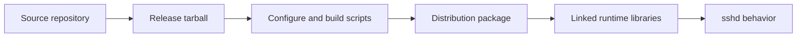

A backdoor in upstream xz/liblzma was disclosed today on the oss-security mailing list. The report covers tainted xz release tarballs for versions 5.6.0 and 5.6.1. The hidden code runs at build time. It can affect sshd on some Linux systems.

The payload is bad. The route to it is worse. The report points to gaps between the source repository and the release tarballs. Scripts fire during configure. Test files carry hidden data. The runtime code seems to hook into OpenSSH login paths through linked libraries.

This is supply-chain security at its worst. Trust here is a build artifact. It rides on tarballs, scripts, and link graphs, not on your gut feel about a project.

{: w="700" h="400" .shadow }
_The xz disclosure shows why source, tarballs, build scripts, package patches, and runtime linkage all belong in the security model._

## Why March 29 matters

Andres Freund's oss-security post is the public technical writeup. Red Hat assigned CVE-2024-3094. Red Hat warned Fedora Rawhide and Fedora 40 beta users. The issue seems to hit pre-release and rolling builds. It spares most stable Linux releases. Even so, it can bite any project that ships from tarballs.

This is not a bad commit a reviewer can catch in plain application code. The bad code hides in release artifacts. It wakes up during build and runtime, and only under set conditions.

{: .prompt-warning }
This is an active security incident. For real fixes, follow your distribution's advisories. Do not rely on a blog summary.

## The attack surface is the pipeline

This case is a reminder. "open source" does not always mean "the artifact I installed matches the code I reviewed."

Every arrow is a security boundary. A tarball can hold built files you never see in the repository. A configure script can turn test data into a running shell command. A package can link libraries in ways the upstream app does not. A runtime loader can tie a compression library to login.

That chain is why this case feels bigger than one tool.

## What makes this case stand out

The disclosure points to a hidden script slipped in through the build. The data sits in files under `tests/files`{: .filepath }. The attack targets set conditions: x86-64 Linux, GCC, GNU ld, glibc, and Debian or RPM build setups.

The sshd path is indirect. OpenSSH does not use liblzma on its own. But some distributions patch OpenSSH for systemd notify, and libsystemd depends on lzma. That path can pull liblzma into the sshd process.

Treat the link path as part of your threat model. Risk is not just the imports you see in source code. Runtime link graphs matter too.

## Practical lessons

A few defenses just moved from nice-to-have to must-have:

- Compare release tarballs against archives built from the repository.
- Treat built files as code you must review.
- Reproduce builds where you can.
- Keep pre-release channels apart from production.
- Watch for slow performance, crashes, and sanitizer output.
- Fund and back the people who maintain core packages.

Freund noticed odd signs. SSH logins used more CPU. Valgrind threw errors. That kind of curiosity is an underrated defense.

## Open questions

Today's disclosure does not settle the full scope or who did it. The job right now is to contain and verify. Downgrade or replace the affected xz versions. Follow your distribution's guidance. Check the build paths it touched.

The long-term question is harder. Modern software leans on thin teams, release tooling, deep dependency chains, and distribution patches. A safe ecosystem needs more than code review. It needs artifact review. It needs provenance, reproducible builds, clear dependency views, and the staff to keep packages alive.

The xz backdoor is a security incident. It is also a map of where trust really lives.

## References

- [oss-security: backdoor in upstream xz/liblzma leading to ssh server compromise](https://www.openwall.com/lists/oss-security/2024/03/29/4)
- [Red Hat: urgent security alert for Fedora 40 and Fedora Rawhide users](https://www.redhat.com/en/blog/urgent-security-alert-fedora-40-and-rawhide-users)
