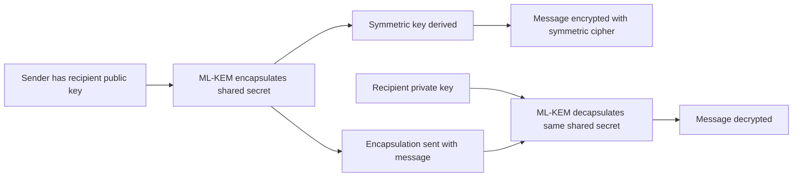

Post-quantum cryptography is leaving the standards conversation and entering the tools people use day to day. GnuPG 2.5.19, announced on April 24, 2026, is a useful signal. The 2.5 series adds Kyber, now standardized as ML-KEM in FIPS 203, as a post-quantum encryption algorithm.

Encrypted files, email, package signatures, and key-management workflows are not suddenly quantum-safe because of this release. The migration is becoming concrete. The work is moving from "cryptographers should solve this" to "software teams need to inventory, upgrade, test, and maintain this."

{: w="700" h="394" .shadow }
_Post-quantum migration is less about one algorithm swap and more about making cryptographic systems easier to change._

## First, A Vocabulary Fix

People often say "quantum crypto" when they mean several different things.

Quantum cryptography usually refers to systems that use quantum physics directly, such as quantum key distribution. Post-quantum cryptography is different. It runs on classical software and math. Its algorithms are designed so that known quantum attacks should not break them efficiently.

The GnuPG news is about post-quantum cryptography. The distinction keeps the engineering problem grounded as a software migration, rather than a speculative hardware story.

## Why Quantum Computers Threaten Today's Public-Key Crypto

Modern public-key systems rely on math problems that are hard for ordinary computers. RSA leans on the difficulty of factoring large integers. Elliptic-curve cryptography leans on the difficulty of discrete logarithm problems over elliptic curves.

A capable quantum computer would change that risk model. Shor's algorithm showed that quantum computers can solve the underlying factoring and discrete-log problems far faster than classical computers. That speed would break much of today's public-key encryption and signatures.

Symmetric cryptography does not disappear overnight, but protocols, keys, certificates, signatures, package verification, secure email, update systems, and long-lived encrypted data all need serious attention.

## What GnuPG Changed

GnuPG is one of the most practical places for this transition to show up. It is a free implementation of OpenPGP and S/MIME. Teams use it widely for encryption, signing, key management, software distribution, and integration through libraries such as GPGME.

The April 2026 release announcement for GnuPG 2.5.19 says the 2.5 series adds Kyber, also called ML-KEM or FIPS 203, as a post-quantum encryption algorithm. It also notes that the older 2.4 series is nearing end-of-life. That timing makes this less of a lab curiosity and more of an upgrade-path question.

{: .prompt-info }
GnuPG's PQC support is about encryption, not a blanket statement that every signing or certification workflow is post-quantum today. The remaining gaps are what migration planning has to cover.

## Why ML-KEM Matters

NIST finalized its first three post-quantum cryptography standards in 2024. FIPS 203 defines ML-KEM, the Module-Lattice-Based Key-Encapsulation Mechanism, based on the CRYSTALS-Kyber algorithm. NIST means it to be the primary standard for general encryption and key establishment.

The core engineering idea is a key encapsulation mechanism. Instead of encrypting a large message with public-key math, a KEM helps two parties agree on shared secret material. That shared secret then feeds symmetric encryption, where modern systems are already strong and fast.

At a high level:

The math underneath ML-KEM comes from module lattices, not the integer factoring or elliptic-curve discrete-log assumptions that quantum computers threaten more directly. Lattice hardness is what makes it a core part of the post-quantum transition.

## The Real Problem Is Crypto Agility

The hardest part of post-quantum migration is knowing where cryptography lives in the first place, well before any standard gets read or any package gets installed.

Cryptography tends to hide in layers:

- TLS libraries and certificate chains.
- SSH keys and automation scripts.
- Package signing and release verification.
- S/MIME, OpenPGP, and archived email.
- Firmware and software update systems.
- Hardware security modules and smartcards.
- Vendor products with embedded crypto choices.

For that reason, CISA, NSA, and NIST have pushed organizations toward quantum-readiness roadmaps, cryptographic inventories, risk assessments, and vendor talks. A system cannot migrate what nobody has mapped.

A plain checklist mindset helps here. [Finding Excellence in Simplicity: My Journey with "The Checklist Manifesto"](/posts/Lessons-Learned-A-Checklist-Manifesto/) covers simple process tools as a form of professional discipline. Post-quantum migration needs the same discipline. Find the cryptography, classify it, prioritize it, and keep revisiting it.

## What Software Teams Should Take From This

GnuPG's move does not call for switching everything immediately and declaring victory. It signals that the ecosystem is starting to provide real migration hooks.

For a software team, a reasonable first pass looks like this:

- Identify systems that use RSA, ECDH, ECDSA, or other public-key cryptography.
- Separate confidentiality risks from authenticity risks. Encryption and signatures have different migration paths.
- Prioritize data with a long secrecy lifetime because of harvest-now, decrypt-later risk.
- Track dependency support for ML-KEM and post-quantum signatures.
- Test upgrades in workflows that already use tools like GnuPG, SSH, TLS, package signing, or S/MIME.
- Prefer designs that can change algorithms again without rewriting the whole system.

The last point is crypto agility. The safest long-term design rotates algorithms as standards, implementations, and threat models mature, rather than assuming ML-KEM is the final answer forever.

## Caveats Worth Keeping

Post-quantum cryptography does not make systems automatically secure. Bugs, bad randomness, unsafe defaults, key-management mistakes, side channels, confusing UX, and weak operations all still matter.

It also does not remove the need for signatures. ML-KEM handles key establishment for encryption. NIST's finalized signature standards include ML-DSA and SLH-DSA, but support across everyday tools will arrive unevenly.

Finally, compatibility will be messy. Security tools have to work across old keys, old messages, regulated environments, smartcards, package managers, automation, and users who do not care what a lattice is. That broad compatibility surface stretches the transition into years rather than weeks.

## Practical Takeaway

The GnuPG release makes post-quantum cryptography concrete. Standards are necessary, but tools are where adoption becomes real.

Cryptography is best treated as infrastructure with a maintenance plan. Teams should know where it is, know why it is there, and design systems so the next algorithm transition is less painful than the last one.

The quantum-safe future will arrive through ordinary release notes, library upgrades, compatibility testing, inventories, and teams doing careful engineering before the emergency, rather than as one dramatic switch.

## References

- GnuPG, ["GnuPG 2.5.19 released"](https://lists.gnupg.org/pipermail/gnupg-announce/2026q2/000504.html), April 24, 2026.
- NIST, ["NIST Releases First 3 Finalized Post-Quantum Encryption Standards"](https://www.nist.gov/news-events/news/2024/08/nist-releases-first-3-finalized-post-quantum-encryption-standards), August 13, 2024.
- NIST CSRC, ["FIPS 203: Module-Lattice-Based Key-Encapsulation Mechanism Standard"](https://csrc.nist.gov/pubs/fips/203/final), August 13, 2024.
- CISA, NSA, and NIST, ["Quantum-Readiness: Migration to Post-Quantum Cryptography"](https://www.cisa.gov/resources-tools/resources/quantum-readiness-migration-post-quantum-cryptography), August 21, 2023.
