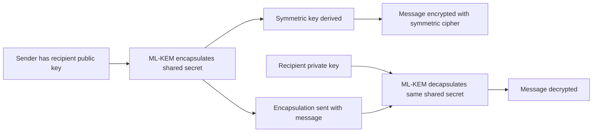

Post-quantum cryptography is moving out of the standards world. It is now showing up in tools people use every day. GnuPG 2.5.19, announced on April 24, 2026, is a useful signal. The 2.5 series adds Kyber, now standardized as ML-KEM in FIPS 203. That is a post-quantum encryption algorithm.

This release does not make your encrypted files, email, package signatures, and key workflows quantum-safe. But the shift is now real. The work is moving from "cryptographers should solve this" to "software teams need to inventory, upgrade, test, and maintain this."

{: w="700" h="394" .shadow }
_Post-quantum work is less about one algorithm swap. It is more about making crypto systems easy to change._

## First, a vocabulary fix

People often say "quantum crypto" when they mean several different things.

Quantum cryptography uses quantum physics directly. One example is quantum key distribution. Post-quantum cryptography is not the same thing. It runs on normal software and math. Its algorithms are built so known quantum attacks should not break them fast.

The GnuPG news is about post-quantum cryptography. That gap matters. It keeps the problem grounded as a software job. It is not a far-off hardware story.

## Why quantum computers threaten today's public-key crypto

Modern public-key systems rest on math that is hard for normal computers. RSA rests on how hard it is to factor large numbers. Elliptic-curve cryptography rests on hard discrete-log problems over elliptic curves.

A strong quantum computer would change that risk. Shor's algorithm showed that quantum computers can solve the factoring and discrete-log problems. And they can do it much faster than normal computers. That speed would break much of today's public-key encryption and signatures.

Symmetric cryptography does not break overnight. But many other things still need a close look. The list is long. It covers protocols, keys, certs, and signatures. It also covers package checks, secure email, update systems, and old encrypted data.

## What GnuPG changed

GnuPG is one of the best places to watch this shift. It is a free build of OpenPGP and S/MIME. Teams use it a lot. It handles encryption, signing, key management, and software releases. It also plugs into code through libraries such as GPGME.

The April 2026 release notes for GnuPG 2.5.19 say the 2.5 series adds Kyber. Kyber is also called ML-KEM or FIPS 203. It is a post-quantum encryption algorithm. The notes also say the older 2.4 series is nearing end-of-life. That makes this less of a lab demo and more of an upgrade question.

{: .prompt-info }
GnuPG's PQC support is about encryption. It does not mean every signing or certification step is post-quantum today. Those gaps are what your migration plan has to cover.

## Why ML-KEM matters

NIST finalized its first three PQC standards in 2024. FIPS 203 defines ML-KEM. The full name is the Module-Lattice-Based Key-Encapsulation Mechanism. It is based on the CRYSTALS-Kyber algorithm. NIST wants it to be the main standard for general encryption and key setup.

The core idea is a key encapsulation mechanism. A KEM helps two sides agree on a shared secret. It skips the slow step of locking a large message with public-key math. That secret then feeds symmetric encryption. And symmetric systems are already strong and fast.

At a high level:

The math under ML-KEM comes from module lattices. It does not rest on integer factoring or elliptic-curve discrete-log math. Those are the problems quantum computers threaten most. Lattice hardness is what makes ML-KEM a core part of the post-quantum shift.

## The real problem is crypto agility

The hardest part of post-quantum work comes first. You have to know where cryptography lives. That step matters long before you read a standard or install a package.

Cryptography tends to hide in layers:

- TLS libraries and certificate chains.
- SSH keys and automation scripts.
- Package signing and release checks.
- S/MIME, OpenPGP, and stored email.
- Firmware and software update systems.
- Hardware security modules and smartcards.
- Vendor products with built-in crypto choices.

So CISA, NSA, and NIST have pushed groups to build quantum-readiness roadmaps. They also ask for crypto inventories, risk checks, and vendor talks. A team cannot move what nobody has mapped.

A plain checklist mindset helps here. [Finding Excellence in Simplicity: My Journey with "The Checklist Manifesto"](/posts/Lessons-Learned-A-Checklist-Manifesto/) treats simple process tools as a form of discipline. Post-quantum work needs the same habit. Find the cryptography, sort it, rank it, and keep checking it.

## What software teams should take from this

GnuPG's move is a sign, not a finish line. The ecosystem is starting to offer real migration hooks. Switching everything at once and calling it done would miss the point.

For a software team, a good first pass looks like this:

- Find systems that use RSA, ECDH, ECDSA, or other public-key cryptography.
- Split confidentiality risks from authenticity risks. Encryption and signatures take different paths.
- Rank data by how long it must stay secret. This guards against harvest-now, decrypt-later risk.
- Track which dependencies support ML-KEM and post-quantum signatures.
- Test upgrades in workflows that already use tools like GnuPG, SSH, TLS, package signing, or S/MIME.
- Favor designs that can swap algorithms again without a full rewrite.

The last point is crypto agility. The safest long-term design swaps algorithms as standards, code, and threats mature. It does not assume ML-KEM is the final answer forever.

## Caveats worth keeping

Post-quantum cryptography does not make a system safe on its own. Bugs still matter. So do bad randomness and unsafe defaults. So do key-handling slips, side channels, confusing UX, and weak operations.

It also does not remove the need for signatures. ML-KEM handles key setup for encryption. NIST's finalized signature standards include ML-DSA and SLH-DSA. But support across everyday tools will arrive at an uneven pace.

Finally, compatibility will be messy. Security tools have to work across old keys and old messages. They also have to handle regulated settings, smartcards, package managers, and scripts. And many users do not care what a lattice is. That wide surface stretches the shift into years, not weeks.

## Practical takeaway

The GnuPG release makes post-quantum cryptography real. Standards are needed. But tools are where adoption takes hold.

Treat cryptography as infrastructure with a maintenance plan. Teams should know where it is and why it is there. They should also design systems so the next algorithm swap hurts less than the last one.

The quantum-safe future will not arrive as one big switch. It will come through plain release notes and library upgrades. It will come through compatibility tests and inventories. And it will come from teams doing careful work before the crunch hits.

## References

- GnuPG, ["GnuPG 2.5.19 released"](https://lists.gnupg.org/pipermail/gnupg-announce/2026q2/000504.html), April 24, 2026.
- NIST, ["NIST Releases First 3 Finalized Post-Quantum Encryption Standards"](https://www.nist.gov/news-events/news/2024/08/nist-releases-first-3-finalized-post-quantum-encryption-standards), August 13, 2024.
- NIST CSRC, ["FIPS 203: Module-Lattice-Based Key-Encapsulation Mechanism Standard"](https://csrc.nist.gov/pubs/fips/203/final), August 13, 2024.
- CISA, NSA, and NIST, ["Quantum-Readiness: Migration to Post-Quantum Cryptography"](https://www.cisa.gov/resources-tools/resources/quantum-readiness-migration-post-quantum-cryptography), August 21, 2023.
