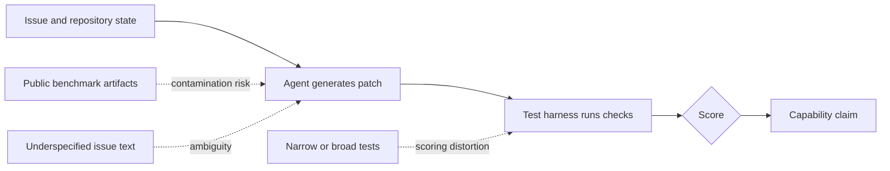

AI coding agents are getting better, but the benchmarks used to measure them are starting to show their age. That is not a minor leaderboard problem. If a benchmark can no longer separate model progress from test artifacts, contamination, or underspecified tasks, then it stops being a reliable engineering instrument.

OpenAI made that point directly in February 2026 when it said it no longer uses SWE-bench Verified as its primary measure of frontier coding capability and recommends SWE-bench Pro instead. The reason was not that SWE-bench Verified was careless. In fact, it was created to improve on earlier SWE-bench issues by using human review. The lesson is sharper than that: even good evaluations can expire.

{: w="700" h="394" .shadow }
_A useful coding benchmark has to test the behavior we care about, not just the behavior that is easiest to score._

## Why This Matters Now

SWE-bench is one of the best-known evaluation families for AI systems that attempt real software engineering tasks. The setup is appealing because it resembles practical work: an agent receives a real GitHub issue, gets access to a repository, produces a patch, and is graded by tests.

That structure is much closer to engineering reality than a toy programming puzzle. It also creates hard evaluation questions:

- Did the model solve the issue, or did it satisfy a narrow test?
- Was the issue description clear enough to support one expected fix?
- Did the benchmark leak into training data, examples, documentation, blog posts, or release notes?
- Are leaderboard gains measuring better software engineering or better benchmark familiarity?

Those questions matter for anyone trying to use AI in a professional development workflow. A benchmark score is only useful if it predicts behavior you would trust in a real repository.

## What SWE-bench Verified Was Trying To Fix

The original SWE-bench benchmark collected real GitHub issues and associated fixes from open-source Python repositories. A model was asked to generate a patch from the issue text and repository state. The patch was then checked with tests that should fail before the fix and pass after it, plus regression tests that should continue passing.

That is a strong idea, but real-world issue data is messy. Some tasks are underspecified. Some tests encode implementation details that are not required by the issue. Some environments are difficult to reproduce. OpenAI and the SWE-bench authors responded by creating SWE-bench Verified, a 500-instance subset reviewed by human annotators for clearer problem statements, fairer tests, and solvable tasks.

That made SWE-bench Verified an important step forward. It filtered a noisy dataset into something more credible. It also became widely reported in frontier model releases, which increased the pressure on it to remain a clean signal.

## What Changed

OpenAI's 2026 audit identified two broad problems with SWE-bench Verified at current model capability levels.

First, some remaining tests are too narrow or too broad. A narrow test can reject a functionally correct patch because it expects a specific implementation detail. A broad test can require behavior that the issue never clearly asked for. Both cases distort the evaluation: the model may look wrong for reasons that are not really about engineering ability.

Second, contamination risk has grown. SWE-bench Verified is public, widely discussed, and tied to open repositories. That openness is valuable for research, but it also means benchmark tasks, fixes, release notes, and discussions can appear in model training or evaluation-adjacent material. A model that has seen the answer pattern is not demonstrating the same skill as one solving the issue from first principles.

{: .prompt-info }
The uncomfortable part is that both problems get worse as models improve. A weak model fails for many reasons, so benchmark flaws can be hidden in the noise. A stronger model exposes the measurement defects.

## A Benchmark Is A Test System

It helps to think about a benchmark as a software system rather than a scoreboard. It has inputs, hidden state, scoring logic, failure modes, and users who will make decisions from the output.

When the scoring logic is brittle, the final number becomes brittle. In normal software, we would call that a test quality problem. In AI evaluation, it can become a market signal, a safety signal, or a procurement signal before anyone notices the foundation is shifting.

## Practical Engineering Takeaways

For engineering teams, the takeaway is not "ignore benchmarks." Benchmarks are useful. The takeaway is to treat them as evidence, not truth.

A good evaluation plan for coding agents should include:

- Public benchmarks for broad comparison.
- Private or freshly authored tasks for contamination resistance.
- Repository-specific tasks that reflect the codebase the agent will actually touch.
- Human review for patches that pass tests but may be brittle, overfit, or hard to maintain.
- Regression checks that measure behavior, not just benchmark success.

This connects to a broader engineering theme I care about: simple process tools often protect complex work. In [Finding Excellence in Simplicity: My Journey with "The Checklist Manifesto"](/posts/Lessons-Learned-A-Checklist-Manifesto/), I wrote about checklists as a way to make expertise more reliable. AI evaluation needs the same humility. Before trusting a model result, check what was measured, how it was measured, and what could have leaked.

It also connects back to the earlier discussion of model learning and evaluation in [AI Innovation: Orca and Progressive Learning](/posts/AI-Innovation%20-Orca-and-Progressive-Learning/). As models learn from richer traces, explanations, and public examples, evaluation has to become more careful about what information is available before the test begins.

## What This Means For AI Coding Agents

The next phase of coding-agent evaluation will likely look less like one public leaderboard and more like a layered testing program. Public benchmarks can still provide comparability. Private tasks can reduce contamination. Human review can judge maintainability and intent. Production telemetry can show whether the tool actually improves cycle time without increasing defect risk.

That is not as clean as a single number. It is more honest.

Software engineering has always involved judgment under imperfect information. AI coding agents do not remove that judgment. They move it upstream into task design, test design, review design, and release discipline.

## Caveats

SWE-bench Verified still has value as a historical benchmark and as a public comparison point. OpenAI's critique does not mean every result on it is meaningless. It means the benchmark is less suitable for measuring frontier progress now that high-performing systems cluster near the top and contamination risk is harder to control.

SWE-bench Pro is also not magic. OpenAI describes it as empirically less affected by contamination, not perfect. That distinction matters. Every benchmark is a model of reality, and every model eventually needs maintenance.

{: .prompt-tip }
For practical adoption, the safest question is not "Which model has the best benchmark score?" It is "Which evaluation setup best predicts success on our work?"

## References

- OpenAI, ["Why SWE-bench Verified no longer measures frontier coding capabilities"](https://openai.com/index/why-we-no-longer-evaluate-swe-bench-verified/), February 23, 2026.
- OpenAI, ["Introducing SWE-bench Verified"](https://openai.com/index/introducing-swe-bench-verified/), August 13, 2024.
- SWE-bench, ["SWE-bench Verified"](https://www.swebench.com/verified.html).
- SWE-bench, ["Official Leaderboards"](https://www.swebench.com/).
- SWE-bench documentation, ["FAQ"](https://www.swebench.com/SWE-bench/faq/).
