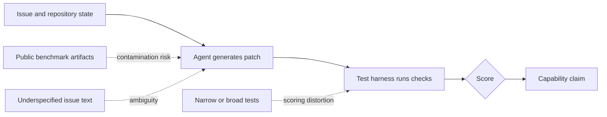

AI coding agents are getting better, but the benchmarks used to score them are starting to show their age. This goes beyond a leaderboard ranking. A benchmark stops being a useful engineering tool once it can no longer tell real model progress apart from test quirks, leaked data, or vague tasks.

OpenAI made that point in February 2026. It said it no longer uses SWE-bench Verified as its main measure of frontier coding skill, and it now points to SWE-bench Pro. SWE-bench Verified was careful work, built to fix earlier SWE-bench issues by adding human review. Even a carefully built test can expire.

{: w="700" h="394" .shadow }
_A useful coding benchmark has to test the behavior we care about, not just the behavior that is easiest to score._

## Why this matters now

SWE-bench is one of the best-known test sets for AI systems that try real software work. The setup is appealing because it looks like the day job. An agent gets a real GitHub issue, opens a repository, writes a patch, and is graded by tests.

That setup is much closer to real work than a toy coding puzzle. It also raises hard questions:

- Did the model solve the issue, or did it satisfy a narrow test?
- Was the issue description clear enough to support one expected fix?
- Did the benchmark leak into training data, examples, documentation, blog posts, or release notes?
- Are leaderboard gains measuring better software engineering or better benchmark familiarity?

These questions matter for anyone trying to use AI in real development work. A benchmark score is only useful if it predicts how the agent will behave in a real repository.

## What SWE-bench Verified was trying to fix

The first SWE-bench benchmark gathered real GitHub issues and their fixes from open-source Python repositories. A model had to write a patch from the issue text and the repository state. Tests then checked the patch. The target tests should fail before the fix and pass after it, while older regression tests should keep passing.

That is a strong idea, but real issue data is messy. Some tasks are vague. Some tests lock in code details the issue never called for. Some setups are hard to reproduce.

OpenAI and the SWE-bench authors answered with SWE-bench Verified. It is a 500-task subset. Human reviewers screened it for clear problem statements, fair tests, and solvable work.

That made SWE-bench Verified a clear step forward. The screening cut the noisy dataset down to a more credible set of tasks. The benchmark also showed up in many frontier model releases, which raised the pressure on it to stay a clean signal.

## What Changed

OpenAI's 2026 audit found two broad problems with SWE-bench Verified at today's model skill levels.

First, some tests are too narrow or too broad. A narrow test can reject a correct patch because it expects one exact way to write the fix. A broad test can demand behavior the issue never asked for. Both cases skew the score. The model can look wrong for reasons that have nothing to do with its skill.

Second, leak risk has grown. SWE-bench Verified is public, widely discussed, and tied to open repos. That openness helps research. It also means the tasks, fixes, notes, and threads can end up in training data. A model that has already seen the answer is not showing the same skill as one that solves the issue from scratch.

{: .prompt-info }
Both problems get worse as models improve. A weak model fails for many reasons, so benchmark flaws hide in the noise. A stronger model lays the test flaws bare.

## A benchmark is a test system

It helps to treat a benchmark as a software system, not a scoreboard. It has inputs, hidden state, scoring logic, failure modes, and users who act on the output.

When the scoring logic is shaky, the final number is shaky too. In normal software, we would call that a test quality problem. In AI scoring, that same number can drive a market, safety, or buying call. The shift often goes unnoticed until later.

## Practical engineering takeaways

Benchmarks still help engineering teams, and ignoring them is the wrong call. They work best as one piece of evidence. Weigh them against other signals rather than read them as ground truth.

A good evaluation plan for coding agents should include:

- Public benchmarks for broad comparison.
- Private or fresh tasks that resist leaked data.
- Repo-specific tasks that match the codebase the agent will touch.
- Human review for patches that pass tests but may be fragile, overfit, or hard to maintain.
- Regression checks that measure real behavior, not just benchmark wins.

This connects to a broader engineering theme: simple process tools often protect complex work. [Finding Excellence in Simplicity: My Journey with "The Checklist Manifesto"](/posts/Lessons-Learned-A-Checklist-Manifesto/) covers checklists as a way to make expertise more reliable. AI evaluation needs the same humility. Before trusting a model result, check what was measured, how it was measured, and what could have leaked.

It also ties back to the earlier look at model learning in [AI Innovation: Orca and Progressive Learning](/posts/AI-Innovation-Orca-and-Progressive-Learning/). As models learn from richer traces, explanations, and public examples, scoring has to get more careful about what the model can see before the test begins.

## What this means for AI coding agents

The next phase of coding-agent scoring will likely look less like one public leaderboard and more like a layered test program. Public benchmarks can still give a shared baseline. Private tasks can cut leaked data. Human review can judge intent and how easy the code is to maintain. Production data can show whether the tool speeds up delivery without adding more bugs.

A layered program trades the tidiness of a single number for a more honest picture of capability.

Software engineering has always called for judgment under imperfect information. AI coding agents do not remove that judgment. They push it upstream into how we design tasks, tests, reviews, and releases.

## Caveats

SWE-bench Verified still has value as a historical benchmark and a public comparison point. Past results on it stay useful under OpenAI's critique. The narrower claim is that it now fits frontier progress poorly. The top systems all cluster near the ceiling, and leaked data is harder to keep out.

SWE-bench Pro is also not magic. OpenAI calls it less affected by leaked data, which is a weaker claim than being free of it. Every benchmark is a model of reality. Every model needs upkeep in the end.

{: .prompt-tip }
For real adoption, the safest question is not "Which model has the best benchmark score?" It is "Which test setup best predicts success on our work?"

## References

- OpenAI, ["Why SWE-bench Verified no longer measures frontier coding capabilities"](https://openai.com/index/why-we-no-longer-evaluate-swe-bench-verified/), February 23, 2026.
- OpenAI, ["Introducing SWE-bench Verified"](https://openai.com/index/introducing-swe-bench-verified/), August 13, 2024.
- SWE-bench, ["SWE-bench Verified"](https://www.swebench.com/verified.html).
- SWE-bench, ["Official Leaderboards"](https://www.swebench.com/).
- SWE-bench documentation, ["FAQ"](https://www.swebench.com/SWE-bench/faq/).
