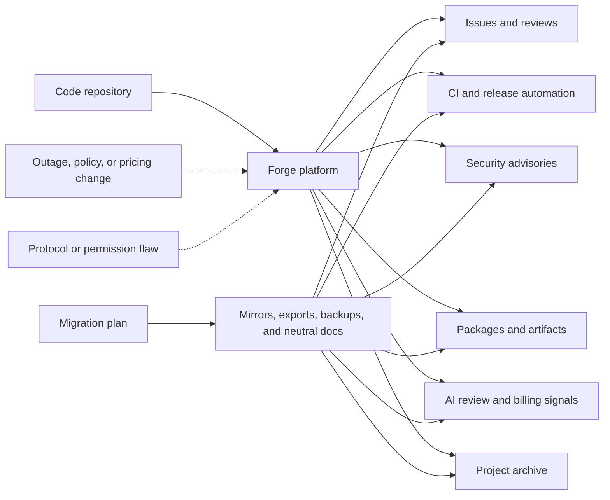

Git is portable. Modern software workflow is not.

That difference matters more than it used to. A repository can be cloned, mirrored, or pushed somewhere else in a few commands. The work around that repository is harder to move. It includes issues, pull requests, review history, CI behavior, release artifacts, security advisories, package publishing, automation secrets, AI review settings, billing controls, and the public memory of a project.

Several recent stories converge on this point. GitHub said Copilot is moving from premium request units to usage-based AI Credits on June 1, 2026. It also said Copilot code review will start using Actions minutes on GitHub-hosted runners in private repositories. Mitchell Hashimoto said Ghostty is leaving the platform. He cited years of frustration with reliability and workflow disruption.

Armin Ronacher wrote a reminder of what GitHub solved for open source, especially discovery and long-term memory. Wiz published a breakdown of CVE-2026-3854, a critical GitHub Enterprise Server flaw. The bug involves `git push` options and the internal git infrastructure. Security researcher Julien Voisin also published a redacted "carrot disclosure" against Forgejo. It claims several bug classes and shows command execution under specific configuration assumptions.

Those different stories point at the same engineering reality. A forge serves at once as collaboration system, CI platform, release channel, trust signal, AI workflow, security boundary, billing surface, and archive. Code lives there, but so does most of the work around it.

Forge dependence is therefore an architecture decision.

{: w="700" h="394" .shadow }
_A modern code forge acts as the hub where review, CI, security, release evidence, AI workflow, and project memory converge, well beyond a plain git remote._

## The Forge Is More Than Git

Git itself is distributed. Every serious clone can contain the full commit graph, and that property still holds.

The less comforting part is that modern development depends on much more than the commit graph:

- Issues and design discussions.
- Pull requests and code review history.
- CI logs, artifacts, and deployment gates.
- Releases, checksums, tags, and package publishing.
- Security advisories and vulnerability coordination.
- Project permissions, teams, and automation secrets.
- AI review agents, usage metrics, budgets, and runner minutes.
- Documentation, discussions, sponsorship signals, and community norms.

Hashimoto's Ghostty announcement makes this distinction directly. Git stayed distributed throughout. The friction came from the surrounding workflow, which became unreliable, distracting, or too expensive for a maintainer's attention budget.

Ronacher's essay makes the historical version of the same point. Before GitHub, projects had many homes, and those homes were fragile. A single personal server might hold the only copy of the source. A download page might link to tarballs that returned 404s within a year. The reasoning behind a release often lived on a mailing list with no public archive. GitHub solved a real memory and discovery problem for open source, even as it concentrated a large part of the ecosystem in one place.

Every model has a failure mode, so neither centralization nor decentralization wins outright. Centralization preserves memory but concentrates dependency. Fragmentation increases autonomy but can make history harder to find.

## Pricing Is Part Of Architecture

Copilot's billing change is important because it turns AI-assisted workflow into an explicit platform cost.

GitHub says paid Copilot plans are moving to AI Credits on June 1, 2026. Usage is calculated from token consumption rather than premium request units. Base plan prices stay the same, and code completions remain included for paid plans. Advanced and agentic usage becomes a metered resource.

Copilot code review tightens the connection further. GitHub says each code review is billed through AI Credits. The agentic infrastructure behind it also consumes Actions minutes when it runs on GitHub-hosted runners in private repositories. GitHub's documentation adds that Copilot code review selects the model on its own, so teams cannot estimate every review by picking a known model up front.

Usage-based pricing may be the only honest way to pay for expensive agentic workflows, so the change is defensible. A quick autocomplete and a repository-aware review do not cost the same to run.

But it changes the engineering conversation. Code review quality, CI capacity, runner policy, AI usage, spending limits, and repository workflow now live inside the same platform. The forge stops being a simple collaboration tool. It becomes a place where technical architecture and operating cost meet.

Leaving that platform is no longer only `git remote add mirror`.

{: .prompt-info }
Whether GitHub is good or bad is the wrong framing. The decision that matters is which parts of an engineering process are portable, and which only work because this platform currently behaves the way teams expect.

## Microsoft Owns The Center Of Gravity

The ownership context matters too.

Microsoft announced its agreement to acquire GitHub for $7.5 billion in stock on June 4, 2018. It completed the acquisition on October 26, 2018. At the time, Microsoft said GitHub would keep its developer-first ethos, operate independently, and remain an open platform.

Azure DevOps is still here. It remains an active Microsoft product family with Boards, Repos, Pipelines, Test Plans, and Artifacts. Microsoft Learn's Azure DevOps roadmap still lists current and future investments across Azure DevOps Services and Azure DevOps Server. That work spans Repos, Pipelines, Test Plans, and GitHub Advanced Security for Azure DevOps.

What changed is gravity. GitHub became Microsoft's public developer network, open-source center of mass, and Copilot delivery surface. Azure DevOps remains important, especially for enterprise teams already invested in Boards, Pipelines, and Azure Repos. But GitHub is where Microsoft brings everything together. Public code hosting, AI assistance, code review, Actions, security scanning, marketplace distribution, identity, and community visibility all sit in one place.

Combining all of those in one place is powerful, and it is also the shape of lock-in.

Lock-in does not have to mean "you can never leave." It often means you can leave the code but not the workflow. The move costs history, automation, habit, integrations, and confidence.

## Security Boundaries Move With The Workflow

The recent GitHub Enterprise Server vulnerability is a reminder that forges are also security systems.

Wiz described CVE-2026-3854 as an internal protocol injection issue. Under certain conditions it could allow remote code execution in GitHub's backend infrastructure. GitHub.com was mitigated, and GHES customers received patches. The broader lesson still extends past one CVE.

Modern developer platforms are distributed systems. They pass metadata through git services, web services, review systems, CI systems, permissions layers, runners, and internal APIs. The forge becomes the coordination point for all of that work. Its internal assumptions then become part of the organization's security boundary.

That matters for self-hosted platforms as much as cloud platforms. Voisin's Forgejo disclosure is useful because it complicates the easy story. Moving away from GitHub may reduce dependence on one vendor, yet the forge layer stays complex. Alternative forges still have auth logic, OAuth flows, git hooks, templating, session handling, registration settings, permissions, and admin operations. A bug in any of those areas can become a security boundary.

The Forgejo post is not the same kind of source as a coordinated vendor advisory or CVE write-up, so it should be read with that caveat. It still illustrates the trade clearly: decentralization buys less vendor concentration at the cost of more operational ownership, rather than free resilience.

## Memory Versus Independence

Centralized forges gave open source something valuable: memory.

It became easy to find old projects, understand who maintained them, review issue history, inspect license signals, and trace how decisions were made. Even abandoned repositories often remained searchable. Engineers vetting a library, recruiters checking a contribution record, package maintainers tracing a fork, and security teams auditing a supply chain all relied on that visibility. Open-source work gained a durable public record that outlived any single contributor.

But durability through one platform is not the same as resilience.

Projects may disperse across Codeberg, Forgejo instances, self-hosted GitLab, mailing lists, independent websites, and company-owned platforms. The ecosystem gains autonomy. It also risks fragmentation. Code may stay cloneable while the human context around the code becomes harder to preserve.

That context carries real weight. It is often the difference between "this dependency is understandable" and "this dependency is an opaque artifact from somewhere on the internet."

## A Practical Resilience Model

Teams do not need to abandon GitHub, GitLab, Codeberg, Forgejo, or Azure DevOps to learn from this moment. They do need to know what they are depending on.

If this diagram feels a little knotted, that is fitting. The dependency graph around a repository can become more complicated than the repository itself.

A mature forge strategy should answer a few boring questions before any emergency:

- Can the repository be mirrored without losing release tags and important branches?
- Are issues, pull requests, discussions, and release notes exportable?
- Are CI secrets and deployment permissions documented somewhere outside the forge?
- Which AI review features consume AI Credits, Actions minutes, or both?
- Are Copilot and Actions budgets configured before automatic review is enabled?
- Can package publishing continue if the forge is down for a day?
- Do security contacts and advisories exist in more than one place?
- Are critical release artifacts archived outside the platform that built them?
- Does the project have a neutral homepage that can point users to a new forge if needed?

These questions are mundane, which is what makes them worth answering. They turn platform anxiety into operational planning.

Post-quantum cryptography shows the same pattern, covered earlier in [the post on GnuPG and post-quantum crypto](/posts/gnupg-post-quantum-crypto-mainline/). Choosing a better algorithm is the easy half. The hard half is building enough agility that systems can change when the world around them changes. Forge agility works the same way. It describes the ability to move without losing the work, independent of how any one provider behaves.

## What Agentic Development Changes

Agentic coding makes the forge more important and more complicated.

A human developer can adapt when GitHub Actions is down, a review queue is stuck, or an issue tracker is unavailable. Automated workflows are more brittle. They expect APIs, permissions, checks, branch protections, repository metadata, billing limits, and runner capacity to all behave the same way every time.

Coding agents remain valuable, but the infrastructure around them needs better failure design. Consider an agent that can produce a patch but cannot recover from a forge outage. It works as a specialized workflow tied to an external service and an external cost model, well short of an autonomous engineer.

Copilot code review is a useful example because it spans several categories at once. It works as an AI feature and a CI feature together. A single review reads repository context, runs on Actions infrastructure, emits review comments, and appears in usage metrics. After June 1, 2026, it draws on both AI Credits and Actions minutes for private repositories on GitHub-hosted runners. The product is useful. It also binds workflow design and platform billing into one loop.

The evaluation problem is related. As [the post on coding benchmarks](/posts/when-coding-benchmarks-stop-measuring-progress/) argues, benchmarks expire when they stop measuring the behavior that matters. Developer infrastructure has a similar trap. A workflow can look efficient while everything is healthy. Hidden coupling shows up later, when the forge, CI system, package registry, or policy layer shifts underneath it.

## What To Do in Practice

A small project does not need to overbuild this. A reasonable baseline looks like this:

- Keep a public canonical repo where contributors already are.
- Maintain a read-only mirror on at least one other forge.
- Keep release artifacts and checksums somewhere independent of CI.
- Put project status, a security contact, and migration notes on a neutral domain or docs site.
- Export issues and release metadata periodically for important projects.
- Avoid turning on automatic AI review everywhere until the billing and runner costs are clear.
- Avoid burying critical operational knowledge only in closed CI settings or private repository configuration.

An organization can go further:

- Inventory which systems depend on forge webhooks, Actions, checks, API tokens, Copilot review, and package publishing.
- Treat repository permissions as production permissions.
- Test a degraded mode where the primary forge is unavailable.
- Set budgets and alerts for Actions and AI usage before rolling agentic review across private repositories.
- Keep a documented path for rotating CI secrets and release credentials.
- Review self-hosted forge security like production infrastructure, not like a side project.
- Track security disclosures for alternative forges with the same seriousness as GitHub advisories.

None of this requires a dramatic platform migration. The most useful step is often just admitting that the forge is part of the system architecture.

## Caveats

There is a risk of turning every GitHub complaint into a grand theory, which overstates the case. GitHub still provides enormous value, and many projects will reasonably stay there. Alternative forges carry their own security, funding, moderation, reliability, and usability challenges. A Forgejo deployment can be the right choice and still demand serious operational care.

There is also a risk of treating every pricing change as a lock-in scheme. Usage-based billing may be the only sustainable way to fund expensive agentic workflows, and charging for compute is fair. The harder problem is that pricing, review behavior, CI capacity, and repository hosting are becoming difficult to reason about separately.

There is also a risk of romanticizing the pre-GitHub web. Ronacher's essay is valuable partly because it does not do that. The old world had more autonomy, but it also lost more history.

The better target is portability with memory rather than nostalgia. Projects should be easier to move, easier to mirror, and easier to archive. They should depend less on one company's product direction for their long-term legibility.

## References

- [Ghostty Is Leaving GitHub](https://mitchellh.com/writing/ghostty-leaving-github)
- [Before GitHub](https://lucumr.pocoo.org/2026/4/28/before-github/)
- [GitHub Copilot is moving to usage-based billing](https://github.blog/news-insights/company-news/github-copilot-is-moving-to-usage-based-billing/)
- [GitHub Copilot code review will start consuming GitHub Actions minutes on June 1, 2026](https://github.blog/changelog/2026-04-27-github-copilot-code-review-will-start-consuming-github-actions-minutes-on-june-1-2026/)
- [Models and pricing for GitHub Copilot](https://docs.github.com/en/copilot/reference/copilot-billing/models-and-pricing)
- [Microsoft to acquire GitHub for $7.5 billion](https://news.microsoft.com/source/2018/06/04/microsoft-to-acquire-github-for-7-5-billion/)
- [Microsoft completes GitHub acquisition](https://blogs.microsoft.com/blog/2018/10/26/microsoft-completes-github-acquisition/)
- [Azure DevOps Roadmap](https://learn.microsoft.com/en-us/azure/devops/release-notes/features-timeline)
- [Securing GitHub: Wiz Research uncovers Remote Code Execution in GitHub.com and GitHub Enterprise Server](https://www.wiz.io/blog/github-rce-vulnerability-cve-2026-3854)
- [NVD: CVE-2026-3854](https://nvd.nist.gov/vuln/detail/CVE-2026-3854)
- [Carrot disclosure: Forgejo](https://dustri.org/b/carrot-disclosure-forgejo.html)
