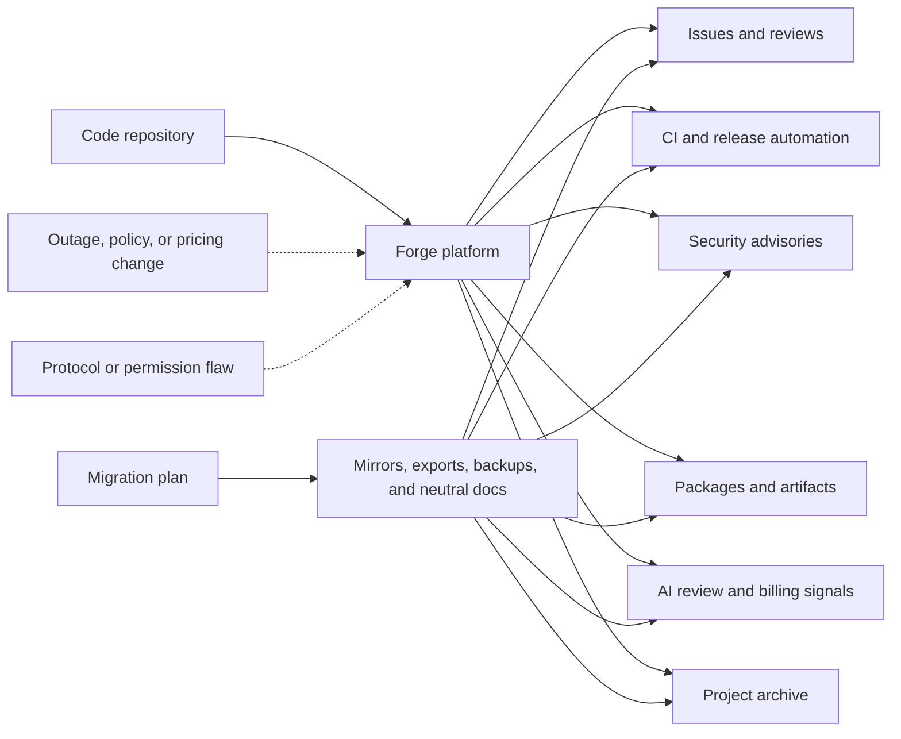

Git is portable. Modern software workflow is not.

That difference matters more than it used to. A repository can be cloned, mirrored, or pushed somewhere else in a few commands. But the work around that repository is harder to move: issues, pull requests, review history, CI behavior, release artifacts, security advisories, package publishing, automation secrets, AI review settings, billing controls, and the public memory of a project.

That is why recent GitHub stories are worth reading together. GitHub announced that Copilot is moving from premium request units to usage-based AI Credits on June 1, 2026. It also announced that Copilot code review will start consuming GitHub Actions minutes when reviews run on GitHub-hosted runners in private repositories. Mitchell Hashimoto announced that Ghostty is leaving GitHub after years of frustration with reliability and workflow disruption. Armin Ronacher wrote a useful reminder of what GitHub solved for open source, especially discovery and long-term memory. Wiz published a detailed breakdown of CVE-2026-3854, a critical GitHub Enterprise Server vulnerability involving `git push` options and GitHub's internal git infrastructure. Security researcher Julien Voisin also published a redacted "carrot disclosure" against Forgejo, claiming multiple vulnerability classes and demonstrating command execution under specific configuration assumptions.

Those are different stories, but they point at the same engineering reality: a forge is not just a place where code lives. It is part collaboration system, part CI platform, part release channel, part trust signal, part AI workflow, part security boundary, part billing surface, and part archive.

That makes forge dependence an architecture decision.

{: w="700" h="394" .shadow }
_A modern code forge carries far more than git objects: it carries workflow state, release evidence, and community memory._

## The Forge Is More Than Git

Git itself is distributed. Every serious clone can contain the full commit graph. That is the comforting part of the story, and it remains true.

The less comforting part is that modern development depends on much more than the commit graph:

- Issues and design discussions.
- Pull requests and code review history.
- CI logs, artifacts, and deployment gates.
- Releases, checksums, tags, and package publishing.
- Security advisories and vulnerability coordination.
- Project permissions, teams, and automation secrets.
- AI review agents, usage metrics, budgets, and runner minutes.
- Documentation, discussions, sponsorship signals, and community norms.

Hashimoto's Ghostty announcement makes this distinction directly. The problem is not that git stopped being distributed. The problem is that the surrounding workflow can become unreliable, distracting, or too expensive for a maintainer's attention budget.

Ronacher's essay makes the historical version of the same point. Before GitHub, projects had many homes, but those homes were fragile. Servers disappeared. Tarballs rotted. Context was lost. GitHub solved a real memory and discovery problem for open source, even as it concentrated a large part of the ecosystem in one place.

The lesson is not that centralization is always foolish or that decentralization is automatically better. The lesson is that every model has a failure mode. Centralization preserves memory but concentrates dependency. Fragmentation increases autonomy but can make history harder to find.

## Pricing Is Part Of Architecture

Copilot's billing change is important because it turns AI-assisted workflow into an explicit platform cost.

GitHub says paid Copilot plans are moving to AI Credits on June 1, 2026, with usage calculated from token consumption rather than premium request units. Base plan prices are not changing, and code completions remain included for paid plans, but advanced and agentic usage becomes a metered resource.

Copilot code review tightens the connection further. GitHub says each code review is billed through AI Credits, and the agentic infrastructure behind code review also consumes Actions minutes when it runs on GitHub-hosted runners in private repositories. GitHub's documentation also says Copilot code review automatically selects the model, so teams cannot estimate every review by choosing a known model up front.

That is not automatically bad. Usage-based pricing may be the only honest way to pay for expensive agentic workflows. A quick autocomplete and a repository-aware review do not cost the same to run.

But it changes the engineering conversation. Once code review quality, CI capacity, runner policy, AI usage, spending limits, and repository workflow all live inside the same platform, the forge is no longer just a collaboration tool. It becomes a place where technical architecture and operating cost meet.

Leaving that platform is no longer only `git remote add mirror`.

{: .prompt-info }
The question is not "is GitHub good or bad?" The better question is "which parts of our engineering process are portable, and which only work because this platform currently behaves the way we expect?"

## Microsoft Owns The Center Of Gravity

The ownership context matters too.

Microsoft announced its agreement to acquire GitHub for $7.5 billion in stock on June 4, 2018, and completed the acquisition on October 26, 2018. At the time, Microsoft said GitHub would retain its developer-first ethos, operate independently, and remain an open platform.

Azure DevOps did not disappear. It remains an active Microsoft product family with Boards, Repos, Pipelines, Test Plans, and Artifacts. Microsoft Learn's Azure DevOps roadmap still lists current and future investments across Azure DevOps Services and Azure DevOps Server, including Repos, Pipelines, Test Plans, and GitHub Advanced Security for Azure DevOps.

What changed is gravity. GitHub became Microsoft's public developer network, open-source center of mass, and Copilot delivery surface. Azure DevOps remains important, especially for enterprise teams already invested in Boards, Pipelines, and Azure Repos. But GitHub is where Microsoft can combine public code hosting, AI assistance, code review, Actions, security scanning, marketplace distribution, identity, and community visibility in one place.

That is powerful. It is also the shape of lock-in.

Lock-in does not have to mean "you can never leave." It often means "you can leave the code, but not the workflow without losing history, automation, habit, integrations, and confidence."

## Security Boundaries Move With The Workflow

The recent GitHub Enterprise Server vulnerability is a reminder that forges are also security systems.

Wiz described CVE-2026-3854 as an internal protocol injection issue that could allow remote code execution in GitHub's backend infrastructure under certain conditions. GitHub.com was mitigated, and GHES customers received patches, but the broader lesson is not limited to one CVE.

Modern developer platforms are distributed systems. They pass metadata through git services, web services, review systems, CI systems, permissions layers, runners, and internal APIs. When the forge becomes the coordination point for all of that work, its internal assumptions become part of the organization's security boundary.

That matters for self-hosted platforms as much as cloud platforms. Voisin's Forgejo disclosure is useful because it complicates the easy story. Moving away from GitHub may reduce dependence on one vendor, but it does not make the forge layer simple. Alternative forges still have authentication logic, OAuth flows, git hooks, templating, session handling, registration settings, permissions, and administrator operations. Those are all places where bugs can become security boundaries.

The Forgejo post is not the same kind of source as a coordinated vendor advisory or CVE write-up, so it should be read with that caveat. But it still makes the practical point well: decentralization is not free resilience. It is a trade: less vendor concentration, more operational ownership.

## Memory Versus Independence

Centralized forges gave open source something valuable: memory.

It became easy to find old projects, understand who maintained them, review issue history, inspect license signals, and trace how decisions were made. Even abandoned repositories often remained searchable. For engineers, recruiters, package maintainers, and security teams, that visibility mattered. It turned open-source work into a durable public record.

But durability through one platform is not the same as resilience.

If projects disperse across Codeberg, Forgejo instances, self-hosted GitLab, mailing lists, independent websites, and company-owned platforms, the ecosystem gains autonomy. It also risks fragmentation. Code may remain cloneable while the human context around the code becomes harder to preserve.

That context is not decorative. It is often the difference between "this dependency is understandable" and "this dependency is an opaque artifact from somewhere on the internet."

## A Practical Resilience Model

Teams do not need to abandon GitHub, GitLab, Codeberg, Forgejo, or Azure DevOps to learn from this moment. They do need to know what they are depending on.

A mature forge strategy should answer a few boring questions before there is an emergency:

- Can the repository be mirrored without losing release tags and important branches?
- Are issues, pull requests, discussions, and release notes exportable?
- Are CI secrets and deployment permissions documented somewhere outside the forge?
- Which AI review features consume AI Credits, Actions minutes, or both?
- Are Copilot and Actions budgets configured before automatic review is enabled?
- Can package publishing continue if the forge is down for a day?
- Do security contacts and advisories exist in more than one place?
- Are critical release artifacts archived outside the platform that built them?
- Does the project have a neutral homepage that can point users to a new forge if needed?

These questions are not glamorous. That is exactly why they are useful. They turn platform anxiety into operational planning.

This is similar to the lesson from post-quantum cryptography: the hard part is not only choosing a better algorithm, but building enough agility that systems can change when the environment changes. I wrote about that in [the post on GnuPG and post-quantum crypto](/posts/gnupg-post-quantum-crypto-mainline/). The same pattern applies here. Forge agility is not an emotional stance against a provider. It is the ability to move without losing the work.

## What Agentic Development Changes

Agentic coding makes the forge more important and more complicated.

A human developer can adapt when GitHub Actions is down, a review queue is stuck, or an issue tracker is unavailable. Automated workflows are more brittle. They expect APIs, permissions, checks, branch protections, repository metadata, billing limits, and runner capacity to behave predictably.

That does not make coding agents bad. It means the infrastructure around them needs better failure design. A coding agent that can produce a patch but cannot recover from a forge outage is not an autonomous engineer. It is a specialized workflow attached to an external service, with an external cost model.

Copilot code review is a useful example because it crosses boundaries. It is not just an AI feature and not just a CI feature. It reviews a pull request, pulls repository context, runs on Actions infrastructure, emits review comments, appears in usage metrics, and after June 1, 2026, affects both AI Credits and Actions minutes for private repositories on GitHub-hosted runners. That creates a useful product, but also a tighter loop between workflow design and platform billing.

The evaluation problem is related. In [the post on coding benchmarks](/posts/when-coding-benchmarks-stop-measuring-progress/), I argued that benchmarks expire when they stop measuring the behavior we actually care about. Developer infrastructure has a similar trap. A workflow can look efficient while everything is healthy, then reveal hidden coupling when the forge, CI system, package registry, or policy layer changes underneath it.

## What I Would Actually Do

For a small project, I would not overbuild this. A reasonable baseline looks like this:

- Keep a public canonical repo where contributors already are.
- Maintain a read-only mirror on at least one other forge.
- Keep release artifacts and checksums somewhere independent of CI.
- Put project status, security contact information, and migration notes on a neutral domain or documentation site.
- Export issues and release metadata periodically for important projects.
- Avoid enabling automatic AI review everywhere until the billing and runner implications are understood.
- Avoid burying critical operational knowledge only in closed CI settings or private repository configuration.

For an organization, I would go further:

- Inventory which systems depend on forge webhooks, Actions, checks, API tokens, Copilot review, usage metrics, and package publishing.
- Treat repository permissions as production permissions.
- Test a degraded mode where the primary forge is unavailable.
- Set budgets and alerts for Actions and AI usage before rolling agentic review across private repositories.
- Keep a documented path for rotating CI secrets and release credentials.
- Review self-hosted forge security like production infrastructure, not like a side project.
- Track security disclosures for alternative forges with the same seriousness as GitHub advisories.

None of this requires a dramatic platform migration. The most useful step is often just admitting that the forge is part of the system architecture.

## Caveats

There is a risk of turning every GitHub complaint into a grand theory. That is not useful. GitHub still provides enormous value, and many projects will reasonably stay there. Alternative forges also have their own security, funding, moderation, reliability, and usability challenges. A Forgejo deployment can be the right choice and still require serious operational discipline.

There is also a risk of treating every pricing change as a lock-in scheme. Usage-based billing may be the only sustainable way to fund expensive agentic workflows. The issue is not that GitHub charges for compute. The issue is that pricing, review behavior, CI capacity, and repository hosting are becoming harder to reason about separately.

There is also a risk of romanticizing the pre-GitHub web. Ronacher's essay is valuable partly because it does not do that. The old world had more autonomy, but it also lost more history.

The better target is not nostalgia. It is portability with memory: projects should be easier to move, easier to mirror, easier to archive, and less dependent on one company's product direction for their long-term legibility.

## References

- [Ghostty Is Leaving GitHub](https://mitchellh.com/writing/ghostty-leaving-github)
- [Before GitHub](https://lucumr.pocoo.org/2026/4/28/before-github/)
- [GitHub Copilot is moving to usage-based billing](https://github.blog/news-insights/company-news/github-copilot-is-moving-to-usage-based-billing/)
- [GitHub Copilot code review will start consuming GitHub Actions minutes on June 1, 2026](https://github.blog/changelog/2026-04-27-github-copilot-code-review-will-start-consuming-github-actions-minutes-on-june-1-2026/)
- [Models and pricing for GitHub Copilot](https://docs.github.com/en/copilot/reference/copilot-billing/models-and-pricing)
- [Microsoft to acquire GitHub for $7.5 billion](https://news.microsoft.com/source/2018/06/04/microsoft-to-acquire-github-for-7-5-billion/)
- [Microsoft completes GitHub acquisition](https://blogs.microsoft.com/blog/2018/10/26/microsoft-completes-github-acquisition/)
- [Azure DevOps Roadmap](https://learn.microsoft.com/en-us/azure/devops/release-notes/features-timeline)
- [Securing GitHub: Wiz Research uncovers Remote Code Execution in GitHub.com and GitHub Enterprise Server](https://www.wiz.io/blog/github-rce-vulnerability-cve-2026-3854)
- [NVD: CVE-2026-3854](https://nvd.nist.gov/vuln/detail/CVE-2026-3854)
- [Carrot disclosure: Forgejo](https://dustri.org/b/carrot-disclosure-forgejo.html)
