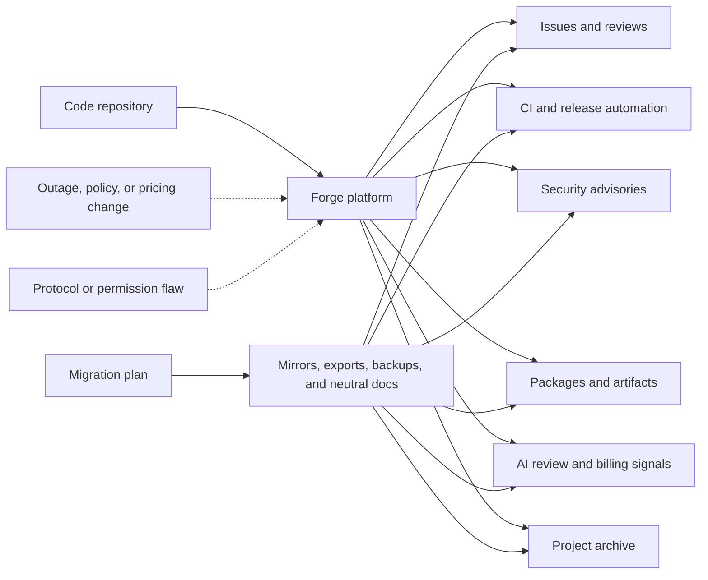

Git is portable. Modern software workflow is not.

That gap matters more than it used to. You can clone, mirror, or push a repo in a few commands. The work around that repo is much harder to move. It holds issues, pull requests, review history, and CI behavior. It also covers release files, security alerts, and package publishing. And it keeps build secrets, AI review settings, billing controls, and the public memory of a project.

Several recent stories point at this. GitHub said Copilot is moving from premium request units to usage-based AI Credits. The switch lands on June 1, 2026. It also said Copilot code review will start using Actions minutes. That use applies on GitHub-hosted runners in private repos.

Mitchell Hashimoto said Ghostty is leaving the platform. He cited years of trouble with uptime and broken workflow.

Armin Ronacher wrote a reminder of what GitHub solved for open source. He pointed mainly to search and long-term memory. Wiz put out a breakdown of CVE-2026-3854. It is a critical GitHub Enterprise Server flaw. The bug involves `git push` options and the inner git plumbing.

Security researcher Julien Voisin also put out a redacted "carrot disclosure" against Forgejo. It claims several bug classes. It shows command execution under some setup choices.

These stories point at the same truth. A forge is many things at once. It hosts the place where people work together. It is a CI platform, a release channel, and a trust signal. It also runs an AI workflow, a security wall, a billing surface, and an archive.

Code lives there, but so does most of the work around it.

So leaning on a forge is a design choice.

{: w="700" h="394" .shadow }
_A modern code forge is a hub. Review, CI, security, release evidence, AI workflow, and project memory all meet there. It is far more than a plain git remote._

## The forge is more than Git

Git itself is distributed. Every serious clone can hold the full commit graph. That part still holds true.

The harder part is that modern development needs much more than the commit graph:

- Issues and design discussions.
- Pull requests and code review history.
- CI logs, artifacts, and deployment gates.
- Releases, checksums, tags, and package publishing.
- Security advisories and vulnerability coordination.
- Project permissions, teams, and build secrets.
- AI review agents, usage metrics, budgets, and runner minutes.
- Docs, discussions, sponsor signals, and community norms.

Hashimoto's Ghostty note makes this split clear. Git stayed distributed the whole time. The friction came from the workflow around it. That workflow grew flaky, noisy, or too costly for a maintainer's time.

Ronacher's essay makes the older version of the same point. Before GitHub, projects had many fragile homes. One personal server might hold the only copy of the source. A download page might link to tarballs that gave 404s within a year. The reason for a release often lived on a mailing list with no public record.

GitHub fixed a real memory and search problem for open source. But it also pulled a large part of the ecosystem into one place.

Every model has a failure mode. So neither approach wins outright. One central home keeps memory but builds up reliance. Spreading out adds freedom but makes history harder to find.

## Pricing is part of architecture

Copilot's billing change matters. It turns AI-assisted work into a clear platform cost. You can now see what each task spends.

GitHub says paid Copilot plans are moving to AI Credits on June 1, 2026. Usage is now based on tokens used, not premium request units. Base plan prices stay the same. Code completions stay included for paid plans. But heavier and agentic usage becomes a metered resource.

Copilot code review ties the knot tighter. GitHub says each code review is billed through AI Credits. The agentic system behind it also uses Actions minutes when it runs on GitHub-hosted runners in private repos. GitHub's docs add one more wrinkle. Copilot code review picks the model on its own. So teams cannot price each review by picking a known model up front.

Usage-based pricing may be the only honest way to pay for costly agentic work. So the change is fair. A quick autocomplete and a repo-aware review do not cost the same to run.

But it changes the engineering talk. Review quality, CI capacity, and runner policy now share one platform. So do AI usage, spending limits, and repo workflow. The forge stops being a simple tool for shared work. It becomes a place where design and cost meet.

Leaving that platform is no longer only `git remote add mirror`.

{: .prompt-info }
Whether GitHub is good or bad is the wrong framing. The question that matters is simpler. Which parts of an engineering process can move? And which parts only work because this platform behaves the way teams expect today?

## Microsoft owns the center of gravity

The ownership context matters too.

On June 4, 2018, Microsoft announced a deal to acquire GitHub for $7.5 billion in stock. It closed the deal on October 26, 2018. At the time, Microsoft said GitHub would keep putting developers first. It would run on its own. It would stay an open platform.

Azure DevOps is still here. It is a live Microsoft product family. It has Boards, Repos, Pipelines, Test Plans, and Artifacts. Microsoft Learn's Azure DevOps roadmap still lists work now and work to come. It spans Azure DevOps Services and Azure DevOps Server. That work covers Repos, Pipelines, Test Plans, and GitHub Advanced Security for Azure DevOps.

What changed is gravity. GitHub became Microsoft's public developer network, open-source hub, and Copilot delivery surface. Azure DevOps still matters most for big teams already deep in Boards, Pipelines, and Azure Repos. But GitHub is where Microsoft brings it all together. Public code hosting, AI help, and code review sit there. So do Actions, security scans, marketplace reach, identity, and a public face.

Combining all of that in one place is powerful. It is also the shape of lock-in.

Lock-in does not have to mean "you can never leave." More often it means you can leave the code but not the workflow. The move costs history, automation, habit, integrations, and trust.

## Security boundaries move with the workflow

The recent GitHub Enterprise Server flaw makes one thing clear. Forges are also security systems.

Wiz called CVE-2026-3854 an internal protocol injection issue. Under the right setup, it could allow remote code execution in GitHub's backend. GitHub.com was fixed. GHES customers got patches. But the lesson runs past one CVE.

Modern developer platforms are distributed systems. They pass data through many layers. Those layers include git services, web services, and review systems. They also cover CI systems, permission layers, runners, and internal APIs. The forge ties all that work together. Its inner rules then become part of the team's security boundary.

This matters for self-hosted platforms as much as cloud ones. Voisin's Forgejo disclosure is useful here because it muddies the easy story. Moving off GitHub may cut your reliance on one vendor, but the forge layer stays complex. Other forges still have auth logic, OAuth flows, git hooks, and templating. They also have session handling, sign-up settings, permissions, and admin tasks. A bug in any of those areas can become a security boundary.

The Forgejo post is not the same kind of source as a vendor advisory or CVE write-up. Read it with that caveat. It still shows the trade clearly. Spreading out buys less reliance on one vendor. The cost is more work you have to own. It is not free resilience.

## Memory versus independence

Big shared forges gave open source something useful: memory.

It became easy to find old projects and see who ran them. You could read issue history, check license signals, and trace how choices were made. Even dead repos often stayed easy to find. Many people leaned on that view: engineers vetting a library, recruiters checking a track record, package owners tracing a fork, and security teams auditing a supply chain. Open-source work gained a lasting public record. It outlived any single author.

But lasting through one platform is not the same as resilient.

Projects may spread out. They land on Codeberg, Forgejo instances, self-hosted GitLab, mailing lists, personal sites, and company-owned platforms. The ecosystem gains freedom. But it also risks splitting apart. Code may stay easy to clone. But the human context around it gets harder to keep.

That context carries real weight. It is often the gap between "this dependency is understandable" and "this dependency is an opaque artifact from somewhere on the internet." You can trust the first one. You can only hope about the second.

## A practical resilience model

You do not need to abandon GitHub, GitLab, Codeberg, Forgejo, or Azure DevOps to learn from this moment. You do need to know what you depend on.

If this diagram feels a little tangled, that is fitting. The web of links around a repo can grow more tangled than the repo itself.

A solid forge plan should answer a few boring questions before any crisis:

- Can the repo be mirrored without losing release tags and key branches?
- Are issues, pull requests, discussions, and release notes exportable?
- Are CI secrets and deployment permissions documented somewhere outside the forge?
- Which AI review features consume AI Credits, Actions minutes, or both?
- Are Copilot and Actions budgets configured before automatic review is enabled?
- Can package publishing continue if the forge is down for a day?
- Do security contacts and advisories exist in more than one place?
- Are critical release artifacts archived outside the platform that built them?
- Does the project have a neutral homepage that can point users to a new forge if needed?

The questions are dull, which is what makes them worth answering. Answering them turns platform worry into a plan.

Post-quantum cryptography shows the same pattern. I covered it earlier in [the post on GnuPG and post-quantum crypto](/posts/gnupg-post-quantum-crypto-mainline/). Picking a better algorithm is the easy half. The hard half is staying nimble enough to change when the world around you changes. Forge agility works the same way. It is the power to move without losing the work, no matter what any one provider does.

## What agentic development changes

Agentic coding makes the forge both more important and more complex.

A human developer can adapt when GitHub Actions is down. The same is true when a review queue is stuck or an issue tracker is offline. Automated workflows are more brittle. They expect APIs, permissions, and checks to act the same way every time. They expect the same from branch protections, repo metadata, billing limits, and runner capacity.

Coding agents are still valuable. But the systems around them need better failure design. Picture an agent that can write a patch but cannot recover from a forge outage. It is a narrow workflow tied to an outside service and an outside cost model. It falls well short of an engineer who works on their own.

Copilot code review is a good example. It spans several roles at once, working as an AI feature and a CI feature together. A single review reads repo context, runs on Actions, posts review comments, and shows up in usage metrics. After June 1, 2026, it draws on both AI Credits and Actions minutes for private repos on GitHub-hosted runners. The product is useful. It also binds workflow design and platform billing into one loop.

The same problem shows up in how we measure things. As [the post on coding benchmarks](/posts/when-coding-benchmarks-stop-measuring-progress/) argues, benchmarks expire when they stop measuring what matters. Developer tooling has a similar trap. A workflow can look clean while all is healthy. Hidden coupling shows up later. It surfaces when the forge, CI system, package registry, or policy layer shifts under it.

## What to do in practice

A small project does not need to overbuild this. A reasonable baseline looks like this:

- Keep a public canonical repo where contributors already are.
- Maintain a read-only mirror on at least one other forge.
- Keep release artifacts and checksums somewhere independent of CI.
- Put project status, a security contact, and migration notes on a neutral domain or docs site.
- Export issues and release metadata periodically for important projects.
- Avoid turning on automatic AI review everywhere until the billing and runner costs are clear.
- Avoid burying key operational knowledge only in closed CI settings or private repo configuration.

An organization can go further:

- Inventory which systems depend on forge webhooks, Actions, checks, API tokens, Copilot review, and package publishing.
- Treat repo permissions as production permissions.
- Test a degraded mode where the primary forge is unavailable.
- Set budgets and alerts for Actions and AI usage before rolling agentic review across private repos.
- Keep a documented path for rotating CI secrets and release credentials.
- Review self-hosted forge security like production infrastructure, not like a side project.
- Track security disclosures for alternative forges with the same seriousness as GitHub advisories.

None of this needs a dramatic platform migration. Often the most useful step is to admit that the forge is part of the system architecture.

## Caveats

There is a risk of turning every GitHub complaint into a grand theory, which overstates the case. GitHub still gives huge value, and many projects will fairly stay there. Other forges carry their own problems too. They face issues with security, funding, moderation, uptime, and ease of use. A Forgejo deployment can be the right choice and still need serious care.

There is also a risk of treating every pricing change as a lock-in scheme. Usage-based billing may be the only stable way to fund costly agentic work. Charging for compute is fair. The harder problem is that pricing, review behavior, CI capacity, and repo hosting are getting hard to reason about on their own.

There is also a risk of romanticizing the pre-GitHub web. Ronacher's essay is valuable partly because it does not do that. The old world had more freedom. But it also lost more history.

The better target is portability with memory, not nostalgia. Projects should be easier to move, mirror, and archive. They should lean less on one company's road map to stay clear over time.

## References

- [Ghostty Is Leaving GitHub](https://mitchellh.com/writing/ghostty-leaving-github)
- [Before GitHub](https://lucumr.pocoo.org/2026/4/28/before-github/)
- [GitHub Copilot is moving to usage-based billing](https://github.blog/news-insights/company-news/github-copilot-is-moving-to-usage-based-billing/)
- [GitHub Copilot code review will start consuming GitHub Actions minutes on June 1, 2026](https://github.blog/changelog/2026-04-27-github-copilot-code-review-will-start-consuming-github-actions-minutes-on-june-1-2026/)
- [Models and pricing for GitHub Copilot](https://docs.github.com/en/copilot/reference/copilot-billing/models-and-pricing)
- [Microsoft to acquire GitHub for $7.5 billion](https://news.microsoft.com/source/2018/06/04/microsoft-to-acquire-github-for-7-5-billion/)
- [Microsoft completes GitHub acquisition](https://blogs.microsoft.com/blog/2018/10/26/microsoft-completes-github-acquisition/)
- [Azure DevOps Roadmap](https://learn.microsoft.com/en-us/azure/devops/release-notes/features-timeline)
- [Securing GitHub: Wiz Research uncovers Remote Code Execution in GitHub.com and GitHub Enterprise Server](https://www.wiz.io/blog/github-rce-vulnerability-cve-2026-3854)
- [NVD: CVE-2026-3854](https://nvd.nist.gov/vuln/detail/CVE-2026-3854)
- [Carrot disclosure: Forgejo](https://dustri.org/b/carrot-disclosure-forgejo.html)
