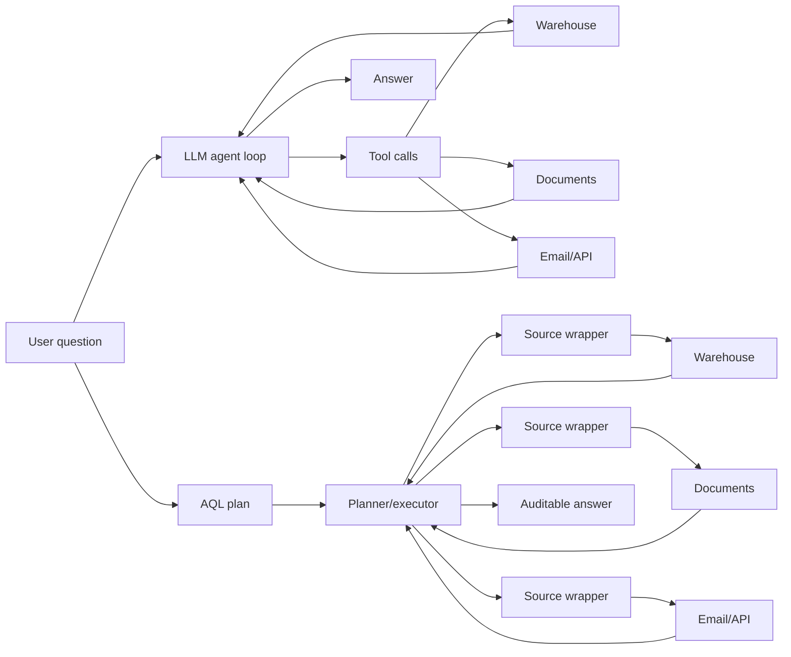

The useful idea in *An Alternate Agentic AI Architecture (It's About the Data)* is not that agentic AI is doomed. It is that enterprise AI questions often fail at the data first. They fail there before they ever reach the hard reasoning.

That is a good database instinct. Key facts live in warehouses, private APIs, documents, email, lab pages, ticket systems, and company web pages. Each source has its own schema, access rules, history, speed, and cost. Treat all of that as a pile of text behind a tool loop and you get a brittle system.

The paper's RUBICON design moves the work out of a hidden LLM loop and into a clear query plan. The pieces are AQL (Agentic Query Language), one wrapper per source, visible mid-step results, and later cost-based planning. This direction deserves real attention.

But the benchmark should not be read as proof. It does not show this design is 100% effective while plain LLM agents are 0% effective. The test is far too small, too closed off, and too kind to the new system. The biggest tell: the hardest step was done by hand before the system ran.

{: w="700" h="394" .shadow }
_RUBICON is strongest when read as a data-integration architecture, not as a general verdict on agents._

## The good part: the data boundary is real

The paper's core point is correct. An LLM cannot answer questions about private data it cannot see, cannot query, or cannot join.

A lot of agent demos blur this line. The demo gives the model a few tools and lets it search. Then it treats the final answer as if the agent had done real, governed data access. In production, the hard parts are less flashy:

- Which source is authoritative for this attribute?
- Is the user allowed to see this row, document, or thread?
- How should a lab website, a warehouse table, and an email message be joined?
- Which intermediate result should be shown for audit?
- What happens when the source schema changes?
- How much does the plan cost before the answer is generated?

RUBICON makes those concerns first-class. It wraps each source. It exposes logical tables. It pushes the system toward clear plans instead of hidden chains of model calls. The paper names the gap well. Copilots that ingest and index your data make it easier to find, but "while this architecture improves discoverability, it does not integrate the underlying data models."

In short, RUBICON is plain data management showing up where it belongs.



> The strongest version of RUBICON is not "LLMs are bad at agents." It is "enterprise agents need query planning, source mediation, permissions, provenance, and inspection."
{: .prompt-info }

## Where the evaluation breaks

The headline result is easy to read too fast. RUBICON scores 100%. The plain LLM and the LangChain ReAct baselines score 0%.

That number comes from seven expert-designed questions. The authors built the benchmark from data they could reach. Each question needs exactly two relevant sources out of five. The other three are distractors. Experts then pulled the ground-truth answers by hand across the required sources.

So read the result as a walk-through of the system. Do not read it as proof of a broad design claim.

**The plain baseline is a negative control, not a rival.** The paper says the plain LLM gets no company-internal facts in its context: "the university data warehouse, the lab research website API, and the email system are not accessible in this configuration." If the questions need those sources, a zero is no shock. It just shows that models cannot read minds.

**The scoring rule is defined two ways.** The metrics section calls a result accurate if it matches the hand-built answer in meaning and logic. The grade rests on the outcome alone. But the results section says a response is marked correct "only if all required sources are consulted *and* the final answer fully matches the ground truth." That blends three different things:

- Answer correctness asks whether the answer is right.
- Source coverage asks whether the system took the expected path.
- Process compliance asks whether the system acted the way the new design wants.

Those three should be reported on their own. The rule behind the table is the strict, process-heavy one. Say a system gets the right answer from one source while the authors picked two. The table still marks it "incorrect." The paper's own earlier rule would have let it pass. A single C/I label hides that gap.

**The benchmark and the design are coupled.** RUBICON is built around clear source picks, wrappers, and known logical views. Its benchmark is built around exactly two required sources per query. Grading rewards using those sources. The result still has worth. But the benchmark tests how well a system fits the authors' frame as much as it tests plain question answering.

**Seven questions cannot show robustness.** A small, fully open benchmark is good for debugging and for showing how a thing works. It is weak proof for a sweeping 100%-versus-0% claim. The source-relevance grid and the ground truth were both built by hand by the same team that proposed the design. There is no held-out set, no blind grading, and no spread across runs.

## The hardest step was done offline, by hand

The headline rests on a quiet but central design choice.

AQL leaves the *structure* of a query to the user. Only the predicate is left to natural language. The paper's "major simplification" is "to require the user to say what attributes from what table they desire and then to generate a natural language predicate":

```text
FIND  <column(s)>
FROM  <table>
WHERE <NL utterance>
```

So for every query, *something* has to build the `FIND`/`FROM`/`JOIN` skeleton: the table, the columns, and the join order. The paper's planned answer is a GUI: "our first version will use a graphical user interface layered above AQL," with natural-language-to-AQL "left to future work."

But the experiment has no GUI and no NL front-end. So who wrote the structural AQL that RUBICON ran?

The paper never says it in one line. But every signal points to the authors. AQL exists, in its own words, to make "the LLM's role narrow and observable: the natural-language predicate is translated into a native call by the wrapper." In the `RUBICON GPT-AQL` setup, GPT-5-mini fills the *wrapper* slot for the NL `WHERE` predicate over a plan that already exists. Building the plan sits outside that model role.

RUBICON makes exactly two tool calls per query (`k = 2.0`, one per required source). That is the mark of a fixed, hand-written two-source plan. A model doing open-ended work would vary. Even the baselines' "AQL prompting" is an author-written rewrite fed to the model as a prompt. So no setup in the paper has a model emit AQL on its own.

That matters because the structure *is* the hard part. The real job is to turn a messy human question into the right table, columns, and join. The enterprise schema is odd. It is full of materialized views, repeated data, and in-house jargon. The paper's own introduction says text-to-SQL fails right there on real warehouses.

So RUBICON's 100% is scored on plans where experts already solved that step. The headline shows that correct, hand-built plans run correctly. It does not show that the plans can be built from a question.

> The paper relocates the hard problem rather than dissolving it. Someone still has to write the structured query, and in the experiment that someone was the research team before the clock started.
{: .prompt-warning }

## The tool-call accounting problem

The paper also argues that RUBICON uses far fewer tool calls than ReAct-style agents. RUBICON sits at `k = 2.0`. ReAct ranges from roughly 3.6 to 22.7. Two details make that gap look bigger than it is.

First, RUBICON's `k = 2.0` is low mostly because it ran a *fixed* plan with no search: the very plan the authors wrote by hand. A ReAct agent handed the same two-source plan would also make about two source calls. Part of the metric just says "we removed the search," not "this architecture is intrinsically leaner."

Second, the line moves on what counts. In ReAct, every source call is a visible agent tool call. In RUBICON, the database calls, API calls, schema translations, cleanup steps, and the in-wrapper LLM call that resolves each predicate all still happen. They just no longer count as agent-loop calls.

Running work in the wrapper may still be a good trade. Fixed parts can beat letting a model wander. The metric should still credit the wrapper for the database calls, API calls, and predicate resolution it now owns. Lower agent-loop counts do not mean that work vanished.

The same line shows up in cost and speed. The paper reports model cost from the provider. It says plainly that this does "not include storage or database costs." It times latency as Time to First Token rather than time to a finished answer. A prototype can fairly make those calls, but they undercount the very infrastructure RUBICON leans on.

The token and cost gaps are still striking. RUBICON averages about 4,200 input tokens, two tool calls, and $0.0036 per query. The most search-heavy agent (Gemini with AQL prompting) balloons to about 469,000 input tokens and $0.28.

So the numbers back a narrower claim. RUBICON cuts unpredictable LLM-loop behavior. It does not show that RUBICON cuts total system work.

## The baseline the paper never runs

Grant the design its best case. AQL narrows the LLM's output to a small, bounded surface. So the model cannot invent free-form structure. It just fills a tight form, which is a real safety win.

The trouble is that pinning an LLM's output to a schema is off-the-shelf tooling in 2026. It does not need a new language.

- **OpenAI Structured Outputs** turn a JSON Schema into a grammar and pin decoding with `strict: true`. So a finished response is schema-valid by build.
- **Anthropic** ships **Structured Outputs** for JSON responses and strict tool use. That bounds tool-call inputs.
- **Google's Gemini** supports structured outputs against a response schema (`responseSchema` with `responseMimeType: "application/json"`).
- **Open-source grammar-constrained decoding** tools such as Outlines, llama.cpp's GBNF grammars, JSONformer, and vLLM's guided decoding can bound output to any context-free grammar. That includes a SQL grammar held to an approved list of tables and columns.

With any of these, you can force a model to emit only `SELECT` statements against approved tables, with approved columns, and with sanctioned joins. That gives you AQL's safety and inspectability on top of real SQL. There is no new language to learn, and a mature toolchain stands behind it.

The honest symmetry is the key point. Constrained decoding locks down syntax and bounds. It does not lock down meaning. The query may parse and stay in bounds while still picking the wrong table. AQL has the same flaw. A wrong column in AQL runs against the wrapper and returns wrong data, just as a wrong SQL query would.

The test that would justify a new language is simple. Is *constrained AQL generation* more reliable in meaning than *constrained SQL generation* on the same task? The paper never runs it. Its baselines are unconstrained ReAct loops, the worst case for LLM-centric systems. They are not "an LLM emitting schema-constrained SQL against the same wrapped sources." A reviewer would ask for that arm in the first round.

## The prototype assumptions matter

RUBICON also leans on a few assumptions that do real work.

The paper describes wrappers that show a relational view over mixed sources, including multimodal ones. It assumes those wrappers "will be constructed locally by enterprise personnel." Add the rule that the user must name the table and columns. That is a long way from an assistant that can read a plain business question and infer the right source model, join path, and predicate on its own.

There is nothing wrong with simplifying a prototype. The problem is where the cuts land. They sit right on top of the hard product work:

- Building and maintaining a bespoke wrapper per source.
- Designing stable logical schemas over unstable systems.
- Translating natural-language predicates into source-specific operations.
- Preserving access control and provenance across joins.
- Optimizing plans across APIs, databases, documents, and model calls.
- Recovering when the plan is underspecified or points at the wrong source.

The paper even grants that AQL "does not necessarily reduce overall tool usage" and "in most cases ... results in at least as many tool calls as NL, and often more." That is a key admission. The win, if it comes, is tighter, more inspectable operations.

## The older database lesson cuts both ways

The paper gets most interesting here. Its senior author, Michael Stonebraker, has made nearby arguments for fifteen years. Those arguments cut against AQL as easily as for it.

In the 2010 CACM piece *MapReduce and Parallel DBMSs: Friends or Foes?*, Stonebraker and coauthors made the case for high-level languages. They held that MapReduce and DBMSs work together rather than swap in for each other:

> "We also feel that higher-level languages are invariably a good idea for any data-processing system. Relational DBMSs have been fabulously successful in pushing programmers to a higher, more-productive level of abstraction, where they simply state *what* they want from the system, rather than writing an algorithm for *how* to get what they want..."

In the 2011 CACM column *Stonebraker on NoSQL and Enterprises*, he leaned on Codd's *what*-versus-*how* split directly. One heading reads **"A Low-Level Query Language is Death,"** and under **"NoSQL Means No Standards"** he warned about the exact failure a wrapper design risks:

> "Seemingly, there are north of 50 NoSQL engines, each with a different user interface... My enterprise guru was very concerned with the proliferation of such one-offs. In contrast, SQL offers a standard environment."

Both pieces close on the same maxim: "those who do not understand the lessons from previous generation systems are doomed to repeat their mistakes," and "stand on the shoulders of those who went before, rather than on their toes."

That history makes RUBICON both more persuasive and more vulnerable.

It is **more persuasive** because the core instinct holds. Do not make analysts or LLMs hand-roll low-level data access when a higher-level layer and an optimizer can do the job. RUBICON's cost-based-planning goal sits right in that tradition.

It is **more vulnerable** because AQL pushes the *user* back toward saying *how*: the table, the columns, and the join order. Only the predicate stays declarative. By the author's own frame, that is a low-level interface.

And the wrappers can turn into the new one-off interfaces. Say every source needs a custom adapter that invents a logical table, translates predicates, enforces access rules, and normalizes results. Then the design inherits the very standards problem he warned about. Without a mature wrapper ecosystem, schema discipline, and portable query meaning, RUBICON risks rebuilding the integration layer one source at a time.

There is an honest counterpoint. Those essays were about *human* programmers learning interfaces. AQL is meant to be machine-generated, with the declarative part left to what LLMs do well. The split is fair, but it does not fit this paper.

In this evaluation, humans wrote the AQL. So the "it's machine-generated" defense does not cover the reported result. And standards concerns do not care who writes the language. The paper never explains why the case that fenced in NoSQL and MapReduce should spare AQL.

> The paper's strongest intellectual ancestry also supplies its sharpest critique: abstraction and planning help only if the interfaces become durable, inspectable, and standardized.
{: .prompt-warning }

## A fairer test would be straightforward

A stronger evaluation would not be hard to design.

1. **Give every system the same data access.** If plain LLMs are included, do one of two things. Give them a retrieval context with the required facts, or label them as a no-private-data control. Agent baselines should get the same tools, permissions, and source descriptions.
2. **Split the scorecard.** Report answer accuracy, required-source coverage, stray-source search, provenance quality, and process compliance on their own. A single C/I label cannot carry all of that.
3. **Use held-out queries and outside grading.** A benchmark meant to back design claims needs more than seven author-written questions. It needs blind grading, and ideally a source-relevance rubric kept by someone else.
4. **Report end-to-end cost.** Count model tokens, tool calls, database queries, API calls, wrapper calls, index and storage overhead, and the work to build the wrappers. If custom wrappers are the price of being deterministic, price them in.
5. **Compare against more than ReAct.** Include retrieval-augmented generation with structured source manifests. Add a SQL or federated-query baseline. Add **an LLM emitting schema-constrained SQL against the same wrappers** (the direct rival to AQL). Add a planner with a fixed source list. Add a wrapper-only, non-LLM baseline for questions that are really just fixed joins.

That would show what RUBICON wins: source completeness, auditability, cost predictability, latency, answer correctness, less model dependence, or access-control enforcement. Each claim needs its own evidence. Some are likely true. The current benchmark does not split them cleanly.

## The better takeaway

RUBICON works best as a reminder that enterprise AI is a systems problem. The answer to a business question is often locked behind schema alignment, permissions, provenance, and integration work. A model cannot reason over data it cannot lawfully and reliably reach.

But the 100%-versus-0% result is not a fair headline. It pits a purpose-built design, running plans the authors wrote by hand, against baselines that fail one of two ways. They either lack the required private data, or they are graded partly on whether they visited the author-picked sources. The score counts visible agent-loop calls while it hides other work behind wrappers. The cost table reports provider token cost but leaves out database and storage cost. It times first token and stops the clock before the finished answer.

The design idea deserves attention. The benchmark claim deserves doubt.

The useful path joins the database lesson with a cleaner test: same data, same permissions, separate metrics, outside grading, full accounting, and a baseline where the LLM writes *constrained SQL* over the same sources. That is how we can see whether a brand-new query language buys anything a constrained standard one does not.

That would make the paper's best argument stronger. Agents need a real data architecture under them.

## References

- Fabian Wenz, Felix Treutwein, Kai Arenja, Çağatay Demiralp, and Michael Stonebraker, ["An Alternate Agentic AI Architecture (It's About the Data)"](https://arxiv.org/abs/2604.21413), arXiv:2604.21413, submitted April 23, 2026.
- Peter Baile Chen, Fabian Wenz, et al., ["BEAVER: An Enterprise Benchmark for Text-to-SQL"](https://arxiv.org/abs/2409.02038), arXiv:2409.02038, 2024. (The paper's own cited evidence for text-to-SQL accuracy drops on real enterprise schemas.)
- E. F. Codd, ["A Relational Model of Data for Large Shared Data Banks"](https://doi.org/10.1145/362384.362685), *Communications of the ACM* 13(6), 1970, 377-387.
- Michael Stonebraker, Daniel J. Abadi, David J. DeWitt, Sam Madden, Erik Paulson, Andrew Pavlo, and Alexander Rasin, ["MapReduce and Parallel DBMSs: Friends or Foes?"](https://cacm.acm.org/magazines/2010/1/55743-mapreduce-and-parallel-dbmss-friends-or-foes/fulltext), *Communications of the ACM* 53(1), 2010, 64-71. DOI: [10.1145/1629175.1629197](https://doi.org/10.1145/1629175.1629197).
- Michael Stonebraker, ["Why Enterprises Are Uninterested in NoSQL"](https://cacm.acm.org/blogcacm/why-enterprises-are-uninterested-in-nosql/), BLOG@CACM, September 30, 2010. (Reprinted as "Stonebraker on NoSQL and Enterprises," *Communications of the ACM* 54(8), 2011, 10-11, DOI: [10.1145/1978542.1978546](https://doi.org/10.1145/1978542.1978546).)
- Michael Stonebraker, ["SQL Databases v. NoSQL Databases"](https://doi.org/10.1145/1721654.1721659), *Communications of the ACM* 53(4), 2010, 10-11.

### Structured-output tooling (the constrained-generation baseline the paper omits)

- OpenAI, [Structured Outputs](https://platform.openai.com/docs/guides/structured-outputs): JSON Schema enforcement with `strict: true`.
- Anthropic, [Structured Outputs](https://docs.claude.com/en/docs/build-with-claude/structured-outputs): constrained decoding for JSON responses and strict tool use.
- Google, [Gemini structured outputs](https://ai.google.dev/gemini-api/docs/structured-output): response-schema-constrained generation.
- Brandon T. Willard and Rémi Louf, ["Efficient Guided Generation for Large Language Models"](https://arxiv.org/abs/2307.09702), arXiv:2307.09702, the method behind [Outlines](https://github.com/dottxt-ai/outlines).
- llama.cpp, [GBNF grammar-constrained decoding](https://github.com/ggml-org/llama.cpp/blob/master/grammars/README.md).
- vLLM, [structured outputs / guided decoding](https://docs.vllm.ai/en/latest/features/structured_outputs.html); [JSONformer](https://github.com/1rgs/jsonformer).
