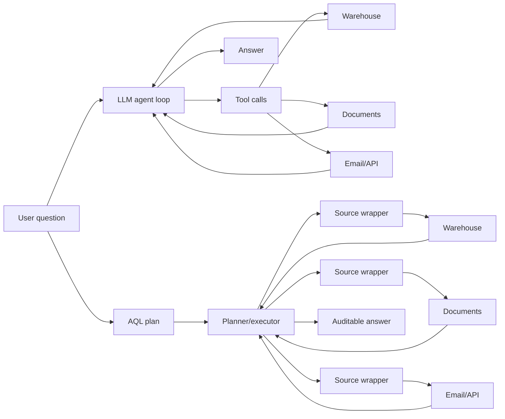

The useful idea in *An Alternate Agentic AI Architecture (It's About the Data)* is not that agentic AI is doomed. It is that enterprise AI questions often fail at the data boundary before they fail at the reasoning boundary.

That is a good database-systems instinct. Critical facts live in warehouses, private APIs, documents, email, lab pages, ticket systems, and institutional web properties. Those sources have schemas, permissions, provenance, latency, and cost. Treating all of that as a pile of text behind a tool-calling loop is a fragile architecture.

The paper's proposed RUBICON architecture tries to move orchestration out of an opaque LLM loop and into explicit query structure: AQL (Agentic Query Language), source-specific wrappers, visible intermediate results, and eventually cost-based planning. This direction deserves serious attention.

The benchmark result should not be treated as proof that this architecture is already 100% effective while ordinary LLM agents are 0% effective. This experiment is much too small, too self-contained, and too favorable to the proposed system to carry that conclusion. Most importantly, the hardest step in the pipeline was performed by hand before the system ran.

{: w="700" h="394" .shadow }
_RUBICON is strongest when read as a data-integration architecture, not as a general verdict on agents._

## The Good Part: The Data Boundary Is Real

The paper's central enterprise point is correct: an LLM cannot reliably answer questions about private operational data it cannot see, cannot query, or cannot join.

A lot of agent demos blur this boundary. The demo gives the model a few tools, lets it search, and then treats the final answer as if the agent had performed governed enterprise data access. In production, the hard parts are often less glamorous:

- Which source is authoritative for this attribute?
- Is the user allowed to see this row, document, or thread?
- How should a lab website, a warehouse table, and an email message be joined?
- Which intermediate result should be shown for audit?
- What happens when the source schema changes?
- How much does the plan cost before the answer is generated?

RUBICON's answer is to make those concerns first-class. It introduces wrappers around heterogeneous sources, exposes logical tables, and pushes the system toward structured plans instead of hidden chains of model calls. The paper puts the diagnosis well: ingestion-and-indexing copilots improve discoverability, but "while this architecture improves discoverability, it does not integrate the underlying data models."

In practice, RUBICON is classic data management showing up where it belongs.



> The strongest version of RUBICON is not "LLMs are bad at agents." It is "enterprise agents need query planning, source mediation, permissions, provenance, and inspection."
{: .prompt-info }

## Where the Evaluation Breaks

The flagship result is easy to summarize and easy to overread: RUBICON scores 100%, while the vanilla LLM and LangChain ReAct baselines score 0%.

That number comes from seven expert-designed questions on a benchmark the authors constructed using data they had access to. The paper says each question requires exactly two relevant sources out of five, with the remaining three serving as distractors. Ground truth was established by manual expert retrieval across the required sources.

Use it as a systems walkthrough, not as evidence for a broad architecture claim.

**The vanilla baseline is a negative control, not a competitor.** The paper explicitly says the vanilla LLM receives no enterprise-internal information in its context window: "the university data warehouse, the lab research website API, and the email system are not accessible in this configuration." If the questions require those sources, then a zero score for the vanilla LLM is not surprising. It confirms that models cannot read minds.

**The scoring rule is defined two different ways.** The metrics section defines accuracy as semantic and logical equivalence to the manually established answer: pure outcome. But the results section says a response is marked correct "only if all required sources are consulted *and* the final answer fully matches the ground truth." That combines three measurements:

- Final-answer correctness asks whether the answer is right.
- Source coverage asks whether the system used the expected path.
- Process compliance asks whether the system behaved the way the proposed architecture wants it to.

Those should be reported separately. The rule that produces the table is the stricter, process-laden one, so a system that reaches the right answer using one source instead of the two the authors designated is marked simply "incorrect." The paper's own earlier definition would not have penalized it. A single C/I label hides that distinction.

**The benchmark and the architecture are coupled.** RUBICON is designed around explicit source selection, wrappers, and known logical views. Its benchmark is designed around exactly two required sources per query. Grading rewards consulting those required sources. The result still has value, but the benchmark measures conformance to the authors' framing as much as it measures general question answering.

**Seven questions cannot establish robustness.** A small, fully disclosed benchmark is good for debugging and explanation. It is weak evidence for a sweeping 100%-versus-0% claim, especially when the source-relevance matrix and ground truth are manually constructed by the same team proposing the architecture, with no held-out set, no blind adjudication, and no variance across runs.

## The Hardest Step Was Done Offline, by Hand

The headline depends on a quiet but central design choice.

AQL's whole design is to leave the *structure* of a query to the user and only the predicate to natural language. The paper's "major simplification" is "to require the user to say what attributes from what table they desire and then to generate a natural language predicate":

```text
FIND  <column(s)>
FROM  <table>
WHERE <NL utterance>
```

So for every query, *something* has to produce the `FIND`/`FROM`/`JOIN` skeleton: which table, which columns, and which join order. The paper's intended answer is a GUI: "our first version will use a graphical user interface layered above AQL," with natural-language-to-AQL "left to future work."

But there is no GUI in the experiment, and no NL front-end. So who wrote the structural AQL that RUBICON executed?

The paper never says in one sentence, but every signal points to the authors. AQL exists, in its own words, to make "the LLM's role narrow and observable: the natural-language predicate is translated into a native call by the wrapper." In the `RUBICON GPT-AQL` configuration, GPT-5-mini fills the *wrapper* slot for the NL `WHERE` predicate over a pre-written plan. Plan generation is outside that model role.

RUBICON's perfectly deterministic two-tool-calls-per-query (`k = 2.0`, one per required source) is the signature of a fixed, human-specified two-source plan, rather than open-ended generation. Even the baselines' "AQL prompting" is an author-written reformulation fed to the model as a prompt, so no configuration in the paper has a model emitting AQL.

That matters because the structure *is* the hard problem. Turning a messy human question into the correct table, columns, and join over an idiosyncratic enterprise schema, full of materialized views, redundancy, and institutional jargon, is exactly what the paper spends its introduction arguing that text-to-SQL fails at on real warehouses. RUBICON's 100% is scored on plans where that step was already solved by experts. The headline measures whether correct, hand-built query plans execute correctly. It does not measure whether the plans can be produced from a question.

> The paper relocates the hard problem rather than dissolving it. Someone still has to write the structured query, and in the experiment that someone was the research team before the clock started.
{: .prompt-warning }

## The Tool-Call Accounting Problem

The paper also argues that RUBICON uses far fewer tool calls than ReAct-style agents: `k = 2.0` against ReAct ranges from roughly 3.6 to 22.7. Two details make that gap read larger than it is.

First, RUBICON's `k = 2.0` is low primarily because it executed a *pre-specified* plan with no exploration: the very plan the authors hand-wrote. A ReAct agent that had been handed the same two-source plan would also make about two source calls. Part of the metric captures "we removed the search," not "this architecture is intrinsically leaner."

Second, the accounting boundary moves. In ReAct, every source interaction is a visible agent tool call. In RUBICON, the database calls, API calls, schema translations, normalization steps, and the in-wrapper LLM call that resolves each predicate still happen; they are no longer counted as exploratory agent-loop calls.

Wrapper execution may still be a good engineering trade. Deterministic components can beat letting a model wander. The metric should track that relocation instead of implying that work disappeared.

The same boundary issue shows up in cost and latency. The paper reports provider-reported model cost and explicitly says it does "not include storage or database costs." It also measures latency as Time to First Token instead of time to a completed answer. Those are understandable choices for a prototype, but they undercount exactly the infrastructure RUBICON depends on. The token and cost deltas are still striking: RUBICON averages about 4,200 input tokens, two tool calls, and $0.0036 per query, while the most exploratory agent (Gemini with AQL prompting) balloons to about 469,000 input tokens and $0.28.

The evidence supports a narrower claim: RUBICON reduces unpredictable LLM-loop behavior. It does not show that RUBICON reduces total system work.

## The Baseline the Paper Never Runs

Grant the architecture its best motivation: AQL narrows the LLM's output to a small, constrained surface, so the model cannot invent arbitrary structure. It fills a tightly bounded form. That is a genuine safety property. The trouble is that constraining an LLM's output to a schema is off-the-shelf infrastructure in 2026, and it does not require inventing a language.

- **OpenAI Structured Outputs** compile a JSON Schema into a grammar and constrain decoding with `strict: true`, so a completed response is schema-valid by construction.
- **Anthropic** ships **Structured Outputs** for JSON responses and strict tool use, which constrains tool-call inputs.
- **Google's Gemini** supports structured outputs against a response schema (`responseSchema` with `responseMimeType: "application/json"`).
- **Open-source grammar-constrained decoding** tools such as Outlines, llama.cpp's GBNF grammars, JSONformer, and vLLM's guided decoding can constrain output to an arbitrary context-free grammar, including a SQL grammar restricted to a whitelist of approved tables and columns.

With any of these, you can force a model to emit only `SELECT` statements, only against approved tables, only referencing approved columns, and only using sanctioned joins. That recreates AQL's safety and inspectability on top of real SQL, with no new language to learn and a mature toolchain behind it.

The honest symmetry is the key point. Constrained decoding guarantees syntax and bounds. It does not guarantee semantics: the query may parse and stay in bounds while still choosing the wrong table. AQL has the same problem. A wrong column in AQL executes against the wrapper and returns wrong data, exactly as a wrong SQL query would.

The comparison that would justify a new language is whether *constrained AQL generation* is more semantically reliable than *constrained SQL generation* on the same task. The paper never runs it. Its baselines are unconstrained ReAct loops, the worst-case version of LLM-centric systems, rather than "an LLM emitting schema-constrained SQL against the same wrapped sources." A reviewer would ask for that arm in the first round.

## The Prototype Assumptions Matter

RUBICON also leans on assumptions that are doing real architectural work.

The paper describes wrappers that expose a relational view over heterogeneous sources, including multimodal ones, and assumes wrappers "will be constructed locally by enterprise personnel." Combined with the requirement that the user name the table and columns, that is a long way from an assistant that reliably infers the right source model, join path, and predicate structure from an ordinary business question.

There is nothing wrong with simplifying a prototype. The issue is that the simplifications sit exactly where the hard product work lives:

- Building and maintaining a bespoke wrapper per source.
- Designing stable logical schemas over unstable systems.
- Translating natural-language predicates into source-specific operations.
- Preserving access control and provenance across joins.
- Optimizing plans across APIs, databases, documents, and model calls.
- Recovering when the plan is underspecified or points at the wrong source.

The paper even concedes that AQL "does not necessarily reduce overall tool usage" and "in most cases ... results in at least as many tool calls as NL, and often more." That is an important admission. The win, if it arrives, is better-bounded, more inspectable operations.

## The Older Database Lesson Cuts Both Ways

This is where the paper becomes most interesting, because its senior author, Michael Stonebraker, has made adjacent arguments for fifteen years. They cut against AQL as readily as for it.

In the 2010 CACM piece *MapReduce and Parallel DBMSs: Friends or Foes?*, Stonebraker and coauthors argued that MapReduce and DBMSs were complementary rather than interchangeable, and pressed the case for high-level languages:

> "We also feel that higher-level languages are invariably a good idea for any data-processing system. Relational DBMSs have been fabulously successful in pushing programmers to a higher, more-productive level of abstraction, where they simply state *what* they want from the system, rather than writing an algorithm for *how* to get what they want..."

In the 2011 CACM column *Stonebraker on NoSQL and Enterprises*, under the heading **"A Low-Level Query Language is Death,"** he invoked Codd's *what*-versus-*how* distinction directly, and under **"NoSQL Means No Standards"** he warned about exactly the failure mode a wrapper architecture risks:

> "Seemingly, there are north of 50 NoSQL engines, each with a different user interface... My enterprise guru was very concerned with the proliferation of such one-offs. In contrast, SQL offers a standard environment."

Both pieces close on the same maxim: "those who do not understand the lessons from previous generation systems are doomed to repeat their mistakes," and "stand on the shoulders of those who went before, rather than on their toes."

That history makes RUBICON both more persuasive and more vulnerable.

It is **more persuasive** because the core instinct is consistent: don't make analysts or LLMs hand-roll low-level data access when a higher-level abstraction and an optimizer can do the job. RUBICON's cost-based-planning ambition is squarely in that tradition.

It is **more vulnerable** because AQL pushes the *user* back toward specifying *how*: which table, which columns, which join order, while keeping declarativeness only in the predicate. By the author's own framing, that is a low-level interface. And the wrappers can become the new one-off interfaces: if every enterprise source needs a bespoke adapter that invents a logical table, translates predicates, enforces access rules, and normalizes results, the architecture inherits precisely the standardization problem he warned about. Without a mature wrapper ecosystem, schema discipline, and portable query semantics, RUBICON risks rebuilding the integration layer one source at a time.

There is an honest counterargument: those essays were about *human* programmers learning interfaces, whereas AQL is meant to be machine-generated, with declarativeness preserved in the part LLMs handle well. The distinction is fair, but it does not fit this paper. For this evaluation, humans wrote the AQL, so the "it's machine-generated" defense does not apply to the reported result. Standards concerns are also indifferent to who writes the language. The paper leaves unexplained why the arguments that constrained NoSQL and MapReduce should spare AQL.

> The paper's strongest intellectual ancestry also supplies its sharpest critique: abstraction and planning help only if the interfaces become durable, inspectable, and standardized.
{: .prompt-warning }

## A Fairer Test Would Be Straightforward

A stronger evaluation would not be hard to design.

1. **Give every system the same data access.** If vanilla LLMs are included, either give them a retrieval context containing the required facts or label them clearly as a no-private-data control. Agent baselines should get identical tools, permissions, and source descriptions.
2. **Split the scorecard.** Report final-answer accuracy, required-source coverage, irrelevant-source exploration, provenance quality, and process compliance separately. A single C/I label cannot carry all of that.
3. **Use held-out queries and independent grading.** A benchmark meant to support architecture claims needs more than seven author-designed questions, blind evaluation, and ideally an independently maintained source-relevance rubric.
4. **Report end-to-end cost.** Count model tokens, tool calls, database queries, API calls, wrapper invocations, indexing/storage overhead, and the engineering cost of the wrappers themselves. If bespoke wrappers are the price of determinism, price them in.
5. **Compare against more than ReAct.** Include retrieval-augmented generation with structured source manifests; a SQL or federated-query baseline; **an LLM emitting schema-constrained SQL against the same wrappers** (the direct rival to AQL); a planner with a fixed source list; and a wrapper-only, non-LLM baseline for questions that are really just deterministic joins.

That would clarify what RUBICON wins: source completeness, auditability, cost predictability, latency, answer correctness, reduced model dependence, or access-control enforcement. Each claim needs its own evidence. Some are likely true. The current benchmark does not separate them cleanly.

## The Better Takeaway

RUBICON should be read as a serious reminder that enterprise AI is a systems problem. The answer to a business question is often locked behind schema alignment, permissions, provenance, and integration work, and a model cannot reason over data it cannot lawfully and reliably access.

But the 100%-versus-0% result is not a fair headline. It compares a purpose-built architecture, running query plans the authors wrote by hand, against baselines that either lack the required private data or are graded partly on whether they visited the author-selected sources. The score counts visible agent-loop calls while moving other work behind wrappers. The cost table reports provider token cost while excluding database and storage cost, and time-to-first-token rather than completed-answer time.

The architecture idea deserves attention. The benchmark claim deserves skepticism.

The useful path is to combine the database lesson with a cleaner evaluation: same data, same permissions, separate metrics, independent grading, end-to-end accounting, and a baseline where the LLM generates *constrained SQL* over the same sources. That is how we can see whether a brand-new query language buys anything that a constrained standard one does not.

That would make the paper's best argument stronger: agents need a real data architecture underneath them.

## References

- Fabian Wenz, Felix Treutwein, Kai Arenja, Çağatay Demiralp, and Michael Stonebraker, ["An Alternate Agentic AI Architecture (It's About the Data)"](https://arxiv.org/abs/2604.21413), arXiv:2604.21413, submitted April 23, 2026.
- Peter Baile Chen, Fabian Wenz, et al., ["BEAVER: An Enterprise Benchmark for Text-to-SQL"](https://arxiv.org/abs/2409.02038), arXiv:2409.02038, 2024. (The paper's own cited evidence for text-to-SQL accuracy drops on real enterprise schemas.)
- E. F. Codd, ["A Relational Model of Data for Large Shared Data Banks"](https://doi.org/10.1145/362384.362685), *Communications of the ACM* 13(6), 1970, 377-387.
- Michael Stonebraker, Daniel J. Abadi, David J. DeWitt, Sam Madden, Erik Paulson, Andrew Pavlo, and Alexander Rasin, ["MapReduce and Parallel DBMSs: Friends or Foes?"](https://cacm.acm.org/magazines/2010/1/55743-mapreduce-and-parallel-dbmss-friends-or-foes/fulltext), *Communications of the ACM* 53(1), 2010, 64-71. DOI: [10.1145/1629175.1629197](https://doi.org/10.1145/1629175.1629197).
- Michael Stonebraker, ["Why Enterprises Are Uninterested in NoSQL"](https://cacm.acm.org/blogcacm/why-enterprises-are-uninterested-in-nosql/), BLOG@CACM, September 30, 2010. (Reprinted as "Stonebraker on NoSQL and Enterprises," *Communications of the ACM* 54(8), 2011, 10-11, DOI: [10.1145/1978542.1978546](https://doi.org/10.1145/1978542.1978546).)
- Michael Stonebraker, ["SQL Databases v. NoSQL Databases"](https://doi.org/10.1145/1721654.1721659), *Communications of the ACM* 53(4), 2010, 10-11.

### Structured-Output Tooling (The Constrained-Generation Baseline The Paper Omits)

- OpenAI, [Structured Outputs](https://platform.openai.com/docs/guides/structured-outputs): JSON Schema enforcement with `strict: true`.
- Anthropic, [Structured Outputs](https://docs.claude.com/en/docs/build-with-claude/structured-outputs): constrained decoding for JSON responses and strict tool use.
- Google, [Gemini structured outputs](https://ai.google.dev/gemini-api/docs/structured-output): response-schema-constrained generation.
- Brandon T. Willard and Rémi Louf, ["Efficient Guided Generation for Large Language Models"](https://arxiv.org/abs/2307.09702), arXiv:2307.09702, the method behind [Outlines](https://github.com/dottxt-ai/outlines).
- llama.cpp, [GBNF grammar-constrained decoding](https://github.com/ggml-org/llama.cpp/blob/master/grammars/README.md).
- vLLM, [structured outputs / guided decoding](https://docs.vllm.ai/en/latest/features/structured_outputs.html); [JSONformer](https://github.com/1rgs/jsonformer).
